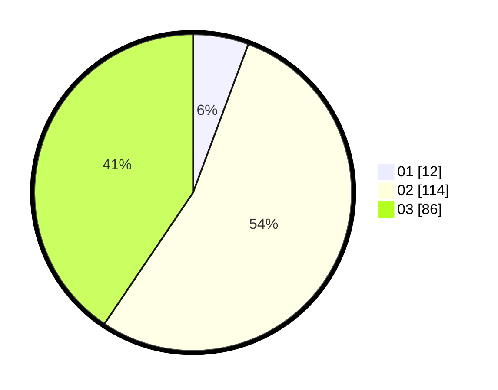

# Hasil

Hasil perolehan suara paslon dapat dilihat pada file paslon-01.txt, paslon-02.txt, dan paslon-03.txt.

Jika tidak ada, artinya data tersebut belum ada pada SIREKAP.

## Perolehan Suara

 * Paslon 01: **12**.
 * Paslon 02: **114**.
 * Paslon 03: **86**.

## Foto C Plano

https://sirekap-obj-formc.kpu.go.id/5e3e/pemilu/ppwp/31/73/01/10/01/3173011001197-20240214-225959--01167115-996f-467a-9cb7-9a1ce9d3db07.jpg

https://sirekap-obj-formc.kpu.go.id/5e3e/pemilu/ppwp/31/73/01/10/01/3173011001197-20240214-230259--c268543c-acb0-4a27-89d2-d9230c982a28.jpg

https://sirekap-obj-formc.kpu.go.id/5e3e/pemilu/ppwp/31/73/01/10/01/3173011001197-20240214-230402--e3323e6c-2b1d-4c06-8099-a30d21855b61.jpg
