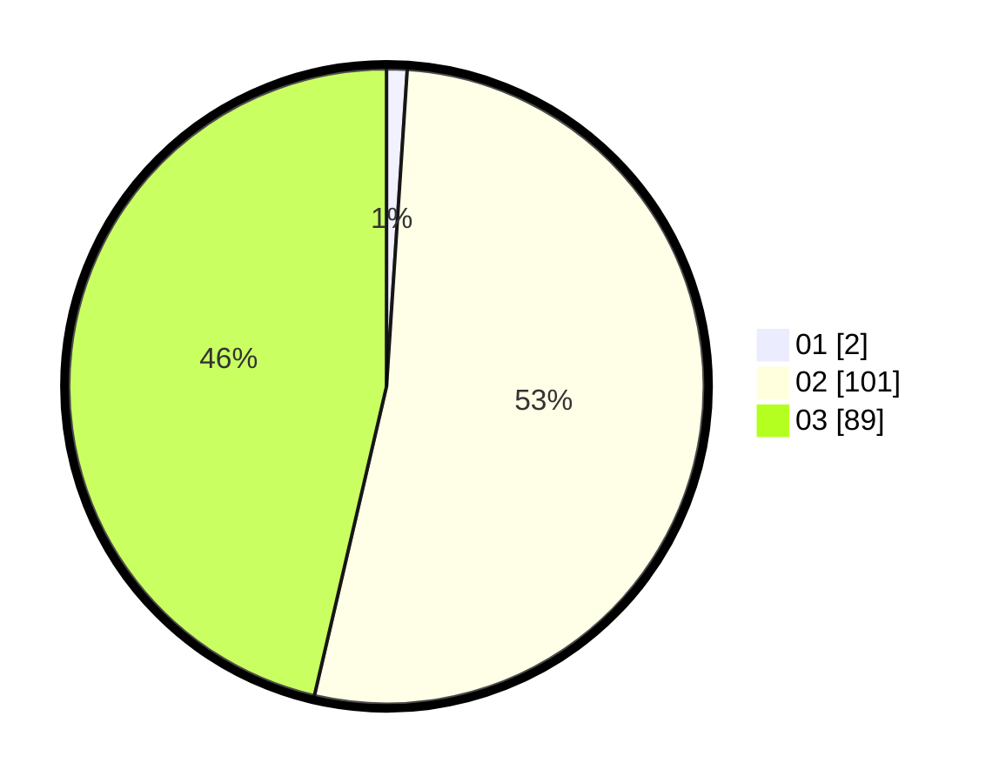

# Hasil

Hasil perolehan suara paslon dapat dilihat pada file paslon-01.txt, paslon-02.txt, dan paslon-03.txt.

Jika tidak ada, artinya data tersebut belum ada pada SIREKAP.

## Perolehan Suara

 * Paslon 01: **2**.
 * Paslon 02: **101**.
 * Paslon 03: **89**.

## Foto C Plano

https://sirekap-obj-formc.kpu.go.id/da77/pemilu/ppwp/31/73/01/10/01/3173011001202-20240214-210316--92db0bde-4e4f-4b45-9cc3-7efdc2a2e90d.jpg

https://sirekap-obj-formc.kpu.go.id/da77/pemilu/ppwp/31/73/01/10/01/3173011001202-20240214-210331--79d21385-214c-40ca-9499-9d10e5b83202.jpg

https://sirekap-obj-formc.kpu.go.id/da77/pemilu/ppwp/31/73/01/10/01/3173011001202-20240214-210344--098c0611-e9ed-474b-98a4-9f00df6e557e.jpg

## DATA PEMILIH TETAP

Jumlah pemilih dalam DPT: **250**.
 * L: **121**.
 * P: **129**.

## DATA PENGGUNA HAK PILIH

Jumlah pengguna hak pilih dalam DPT: **184**.
 * L: **89**.
 * P: **95**.

Jumlah pengguna hak pilih dalam DPTb: **6**.
 * L: **1**.
 * P: **5**.

Jumlah pengguna hak pilih dalam DPK: **3**.
 * L: **1**.
 * P: **2**.

Jumlah pengguna hak pilih: **193**.
 * L: **91**.
 * P: **102**.

## JUMLAH SUARA SAH DAN TIDAK SAH

JUMLAH SELURUH SUARA SAH: **192**.

JUMLAH SUARA TIDAK SAH: **1**.

JUMLAH SELURUH SUARA SAH DAN SUARA TIDAK SAH: **193**.
