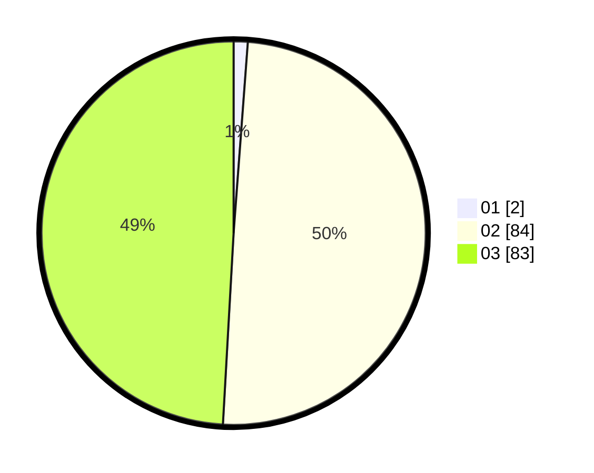

# Hasil

Hasil perolehan suara paslon dapat dilihat pada file paslon-01.txt, paslon-02.txt, dan paslon-03.txt.

Jika tidak ada, artinya data tersebut belum ada pada SIREKAP.

## Perolehan Suara

 * Paslon 01: **2**.
 * Paslon 02: **84**.
 * Paslon 03: **83**.

## Foto C Plano

https://sirekap-obj-formc.kpu.go.id/39a2/pemilu/ppwp/31/73/01/10/01/3173011001204-20240214-155545--5f2179e5-1ee9-4df4-9a37-5300d2e26839.jpg

https://sirekap-obj-formc.kpu.go.id/39a2/pemilu/ppwp/31/73/01/10/01/3173011001204-20240214-203734--cbb250f8-dc85-48fa-9a5d-c4b1198ccc89.jpg

https://sirekap-obj-formc.kpu.go.id/39a2/pemilu/ppwp/31/73/01/10/01/3173011001204-20240214-155624--60a41050-c7a0-4021-8095-53a275ac1243.jpg

## DATA PEMILIH TETAP

Jumlah pemilih dalam DPT: **206**.
 * L: **94**.
 * P: **112**.

## DATA PENGGUNA HAK PILIH

Jumlah pengguna hak pilih dalam DPT: **163**.
 * L: **75**.
 * P: **88**.

Jumlah pengguna hak pilih dalam DPTb: **1**.
 * L: **0**.
 * P: **1**.

Jumlah pengguna hak pilih dalam DPK: **5**.
 * L: **1**.
 * P: **4**.

Jumlah pengguna hak pilih: **169**.
 * L: **76**.
 * P: **93**.

## JUMLAH SUARA SAH DAN TIDAK SAH

JUMLAH SELURUH SUARA SAH: **169**.

JUMLAH SUARA TIDAK SAH: **0**.

JUMLAH SELURUH SUARA SAH DAN SUARA TIDAK SAH: **169**.
