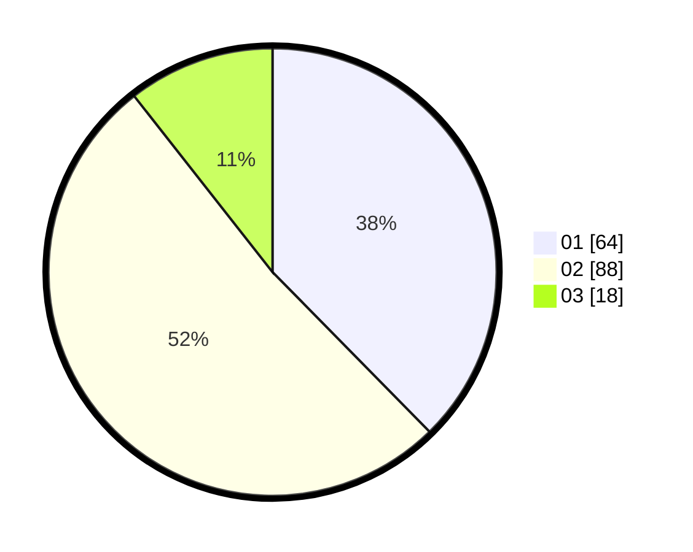

# Hasil

Hasil perolehan suara paslon dapat dilihat pada file paslon-01.txt, paslon-02.txt, dan paslon-03.txt.

Jika tidak ada, artinya data tersebut belum ada pada SIREKAP.

## Perolehan Suara

 * Paslon 01: **64**.
 * Paslon 02: **88**.
 * Paslon 03: **18**.

## Foto C Plano

https://sirekap-obj-formc.kpu.go.id/4266/pemilu/ppwp/31/73/01/10/01/3173011001208-20240214-191603--2fd0ef74-3cf3-4b32-b6a8-9d0c02ff361f.jpg

https://sirekap-obj-formc.kpu.go.id/4266/pemilu/ppwp/31/73/01/10/01/3173011001208-20240214-191620--a753cd93-9c0b-4558-b1c7-39b7ab0beba3.jpg

https://sirekap-obj-formc.kpu.go.id/4266/pemilu/ppwp/31/73/01/10/01/3173011001208-20240214-191638--02a09cd5-a864-49e3-8330-84cecddefc65.jpg
