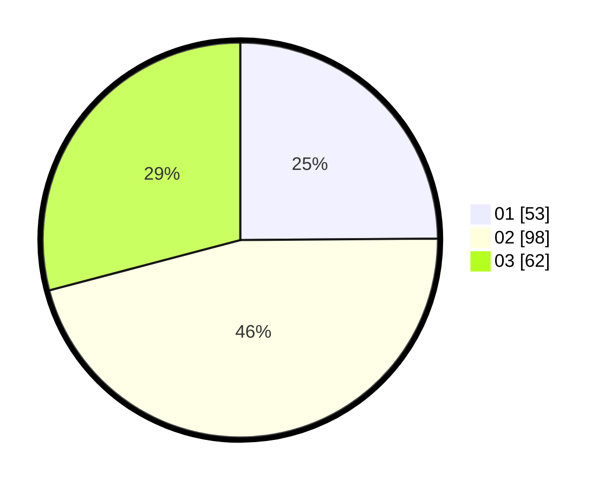

# Hasil

Hasil perolehan suara paslon dapat dilihat pada file paslon-01.txt, paslon-02.txt, dan paslon-03.txt.

Jika tidak ada, artinya data tersebut belum ada pada SIREKAP.

## Perolehan Suara

 * Paslon 01: **53**.
 * Paslon 02: **98**.
 * Paslon 03: **62**.

## Foto C Plano

https://sirekap-obj-formc.kpu.go.id/2013/pemilu/ppwp/31/73/01/10/01/3173011001209-20240215-025356--d29f2cdb-f482-4e36-b01f-8bf531ced25f.jpg

https://sirekap-obj-formc.kpu.go.id/2013/pemilu/ppwp/31/73/01/10/01/3173011001209-20240215-025647--2b54d32f-764f-4fdd-90c1-55c859f83430.jpg

https://sirekap-obj-formc.kpu.go.id/2013/pemilu/ppwp/31/73/01/10/01/3173011001209-20240214-205712--5732cfe3-4f64-4774-815a-23583658579f.jpg
