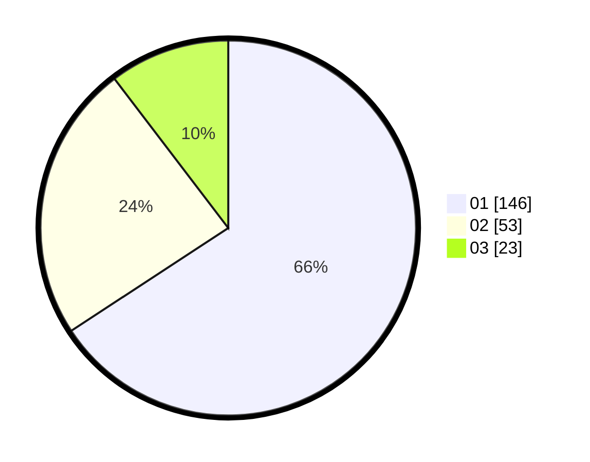

# Hasil

Hasil perolehan suara paslon dapat dilihat pada file paslon-01.txt, paslon-02.txt, dan paslon-03.txt.

Jika tidak ada, artinya data tersebut belum ada pada SIREKAP.

## Perolehan Suara

 * Paslon 01: **146**.
 * Paslon 02: **53**.
 * Paslon 03: **23**.

## Foto C Plano

https://sirekap-obj-formc.kpu.go.id/8fe6/pemilu/ppwp/31/73/01/10/01/3173011001210-20240214-214358--94c59ea7-fa10-40c8-aaac-adb0d8282d3f.jpg

https://sirekap-obj-formc.kpu.go.id/8fe6/pemilu/ppwp/31/73/01/10/01/3173011001210-20240214-214709--14a2bd4d-36b4-413c-9da1-81e8310d76ec.jpg

https://sirekap-obj-formc.kpu.go.id/8fe6/pemilu/ppwp/31/73/01/10/01/3173011001210-20240214-214917--8497effa-eab8-4db5-9c71-3b0ab671fcc0.jpg

## DATA PEMILIH TETAP

Jumlah pemilih dalam DPT: **278**.
 * L: **145**.
 * P: **133**.

## DATA PENGGUNA HAK PILIH

Jumlah pengguna hak pilih dalam DPT: **223**.
 * L: **111**.
 * P: **112**.

Jumlah pengguna hak pilih dalam DPTb: **0**.
 * L: **0**.
 * P: **0**.

Jumlah pengguna hak pilih dalam DPK: **1**.
 * L: **1**.
 * P: **0**.

Jumlah pengguna hak pilih: **224**.
 * L: **0**.
 * P: **0**.

## JUMLAH SUARA SAH DAN TIDAK SAH

JUMLAH SELURUH SUARA SAH: **222**.

JUMLAH SUARA TIDAK SAH: **2**.

JUMLAH SELURUH SUARA SAH DAN SUARA TIDAK SAH: **224**.
