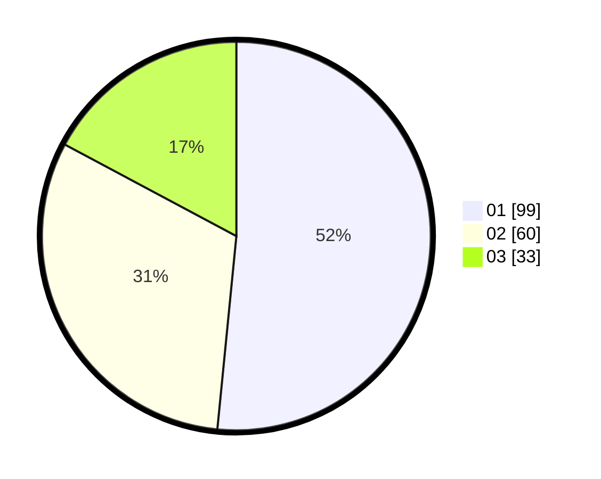

# Hasil

Hasil perolehan suara paslon dapat dilihat pada file paslon-01.txt, paslon-02.txt, dan paslon-03.txt.

Jika tidak ada, artinya data tersebut belum ada pada SIREKAP.

## Perolehan Suara

 * Paslon 01: **99**.
 * Paslon 02: **60**.
 * Paslon 03: **33**.

## Foto C Plano

https://sirekap-obj-formc.kpu.go.id/b21d/pemilu/ppwp/31/73/01/10/01/3173011001213-20240214-185224--fb2fd79d-b08e-4002-b6d8-247e509b813d.jpg

https://sirekap-obj-formc.kpu.go.id/b21d/pemilu/ppwp/31/73/01/10/01/3173011001213-20240214-185235--5d36ccbd-82cb-40ee-adc0-13566e5be1e4.jpg

https://sirekap-obj-formc.kpu.go.id/b21d/pemilu/ppwp/31/73/01/10/01/3173011001213-20240214-185241--529e476e-bb8a-40ee-957a-7e89c6d2b50e.jpg

## DATA PEMILIH TETAP

Jumlah pemilih dalam DPT: **257**.
 * L: **137**.
 * P: **120**.

## DATA PENGGUNA HAK PILIH

Jumlah pengguna hak pilih dalam DPT: **196**.
 * L: **103**.
 * P: **93**.

Jumlah pengguna hak pilih dalam DPTb: **0**.
 * L: **0**.
 * P: **0**.

Jumlah pengguna hak pilih dalam DPK: **0**.
 * L: **0**.
 * P: **0**.

Jumlah pengguna hak pilih: **196**.
 * L: **103**.
 * P: **93**.

## JUMLAH SUARA SAH DAN TIDAK SAH

JUMLAH SELURUH SUARA SAH: **192**.

JUMLAH SUARA TIDAK SAH: **4**.

JUMLAH SELURUH SUARA SAH DAN SUARA TIDAK SAH: **196**.
