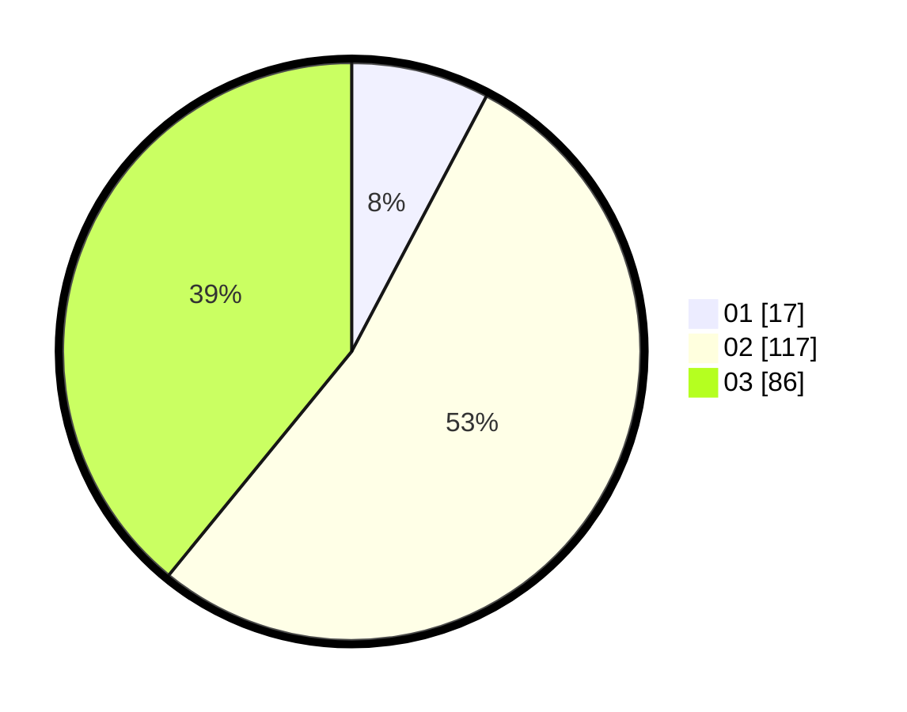

# Hasil

Hasil perolehan suara paslon dapat dilihat pada file paslon-01.txt, paslon-02.txt, dan paslon-03.txt.

Jika tidak ada, artinya data tersebut belum ada pada SIREKAP.

## Perolehan Suara

 * Paslon 01: **17**.
 * Paslon 02: **117**.
 * Paslon 03: **86**.

## Foto C Plano

https://sirekap-obj-formc.kpu.go.id/e627/pemilu/ppwp/31/73/01/10/01/3173011001215-20240216-172353--f5515874-d10d-4e7e-9a03-557f710c854b.jpg

https://sirekap-obj-formc.kpu.go.id/e627/pemilu/ppwp/31/73/01/10/01/3173011001215-20240214-205839--d746ae81-39d5-4313-96e4-15b0661e61e6.jpg

https://sirekap-obj-formc.kpu.go.id/e627/pemilu/ppwp/31/73/01/10/01/3173011001215-20240214-205937--5cf61975-16b6-4439-9be2-90ae6d8a91a1.jpg
