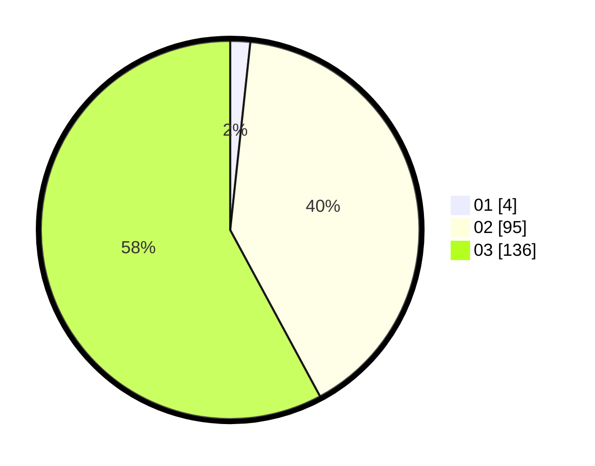

# Hasil

Hasil perolehan suara paslon dapat dilihat pada file paslon-01.txt, paslon-02.txt, dan paslon-03.txt.

Jika tidak ada, artinya data tersebut belum ada pada SIREKAP.

## Perolehan Suara

 * Paslon 01: **4**.
 * Paslon 02: **95**.
 * Paslon 03: **136**.

## Foto C Plano

https://sirekap-obj-formc.kpu.go.id/5ec7/pemilu/ppwp/31/73/01/10/01/3173011001217-20240214-231403--114d8ab6-5aa9-4ebb-b280-d211d3e56f99.jpg

https://sirekap-obj-formc.kpu.go.id/5ec7/pemilu/ppwp/31/73/01/10/01/3173011001217-20240214-231427--6323d8d1-9f0d-4cf3-8c4b-d36061f285f5.jpg

https://sirekap-obj-formc.kpu.go.id/5ec7/pemilu/ppwp/31/73/01/10/01/3173011001217-20240214-210324--f5b0926f-ec9b-4a83-9f06-95136d1d2b37.jpg
