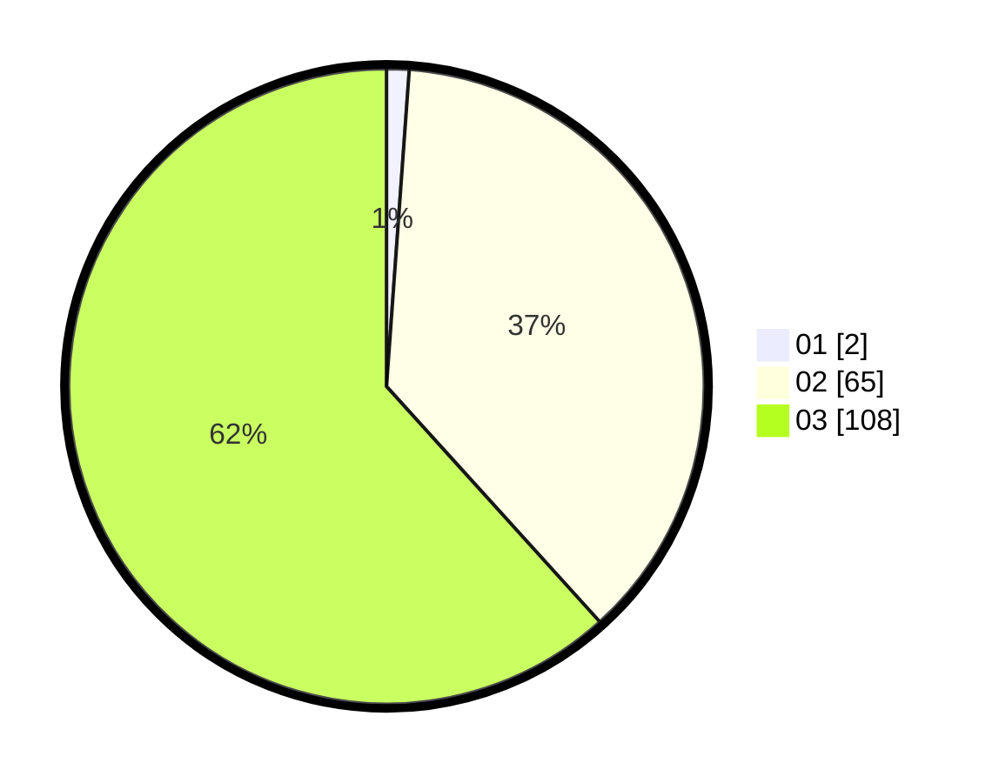

# Hasil

Hasil perolehan suara paslon dapat dilihat pada file paslon-01.txt, paslon-02.txt, dan paslon-03.txt.

Jika tidak ada, artinya data tersebut belum ada pada SIREKAP.

## Perolehan Suara

 * Paslon 01: **2**.
 * Paslon 02: **65**.
 * Paslon 03: **108**.

## Foto C Plano

https://sirekap-obj-formc.kpu.go.id/7004/pemilu/ppwp/31/73/01/10/01/3173011001218-20240214-220907--1cd21b6a-4832-4c2f-a9f6-4d06c86b3b37.jpg

https://sirekap-obj-formc.kpu.go.id/7004/pemilu/ppwp/31/73/01/10/01/3173011001218-20240214-221036--a3e08093-c5ed-42e9-93e5-9f689506dea4.jpg

https://sirekap-obj-formc.kpu.go.id/7004/pemilu/ppwp/31/73/01/10/01/3173011001218-20240214-221156--95c50f5f-a45f-4477-9558-2f18c053bddf.jpg

## DATA PEMILIH TETAP

Jumlah pemilih dalam DPT: **249**.
 * L: **115**.
 * P: **134**.

## DATA PENGGUNA HAK PILIH

Jumlah pengguna hak pilih dalam DPT: **173**.
 * L: **83**.
 * P: **90**.

Jumlah pengguna hak pilih dalam DPTb: **0**.
 * L: **0**.
 * P: **0**.

Jumlah pengguna hak pilih dalam DPK: **3**.
 * L: **2**.
 * P: **1**.

Jumlah pengguna hak pilih: **176**.
 * L: **85**.
 * P: **91**.

## JUMLAH SUARA SAH DAN TIDAK SAH

JUMLAH SELURUH SUARA SAH: **175**.

JUMLAH SUARA TIDAK SAH: **2**.

JUMLAH SELURUH SUARA SAH DAN SUARA TIDAK SAH: **177**.
