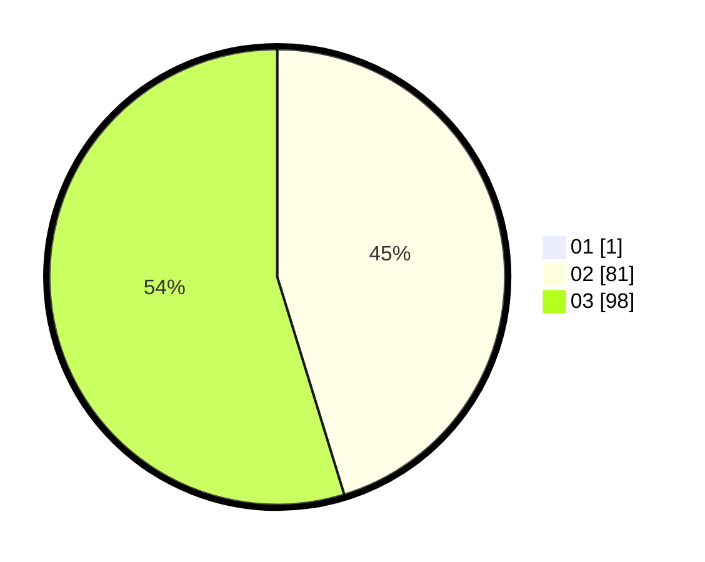

# Hasil

Hasil perolehan suara paslon dapat dilihat pada file paslon-01.txt, paslon-02.txt, dan paslon-03.txt.

Jika tidak ada, artinya data tersebut belum ada pada SIREKAP.

## Perolehan Suara

 * Paslon 01: **1**.
 * Paslon 02: **81**.
 * Paslon 03: **98**.

## Foto C Plano

https://sirekap-obj-formc.kpu.go.id/3e74/pemilu/ppwp/31/73/01/10/01/3173011001220-20240214-212143--2f31db59-45dd-4c9b-9f21-0ba5d9f9c9bd.jpg

https://sirekap-obj-formc.kpu.go.id/3e74/pemilu/ppwp/31/73/01/10/01/3173011001220-20240214-212210--04ef2d42-ad37-46a5-b47b-35c1e46fae66.jpg

https://sirekap-obj-formc.kpu.go.id/3e74/pemilu/ppwp/31/73/01/10/01/3173011001220-20240214-213058--1bb677c9-951a-4f4a-b9c2-bffcea3cc760.jpg
