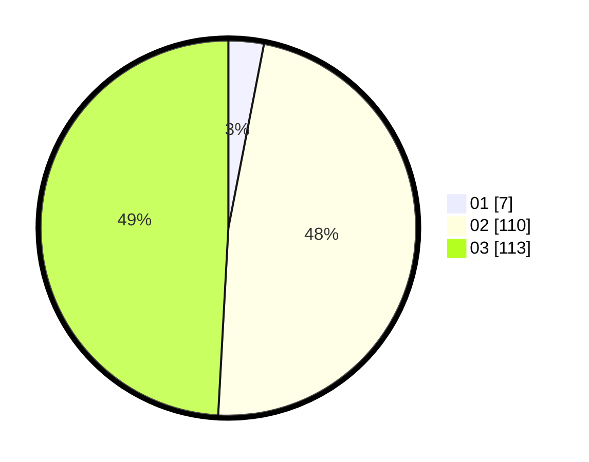

# Hasil

Hasil perolehan suara paslon dapat dilihat pada file paslon-01.txt, paslon-02.txt, dan paslon-03.txt.

Jika tidak ada, artinya data tersebut belum ada pada SIREKAP.

## Perolehan Suara

 * Paslon 01: **7**.
 * Paslon 02: **110**.
 * Paslon 03: **113**.

## Foto C Plano

https://sirekap-obj-formc.kpu.go.id/3b92/pemilu/ppwp/31/73/01/10/01/3173011001222-20240214-223153--504a8e74-9f36-446a-83f0-e0903e5d874f.jpg

https://sirekap-obj-formc.kpu.go.id/3b92/pemilu/ppwp/31/73/01/10/01/3173011001222-20240214-223235--a7270383-311d-4863-8dae-92e8d21e6a93.jpg

https://sirekap-obj-formc.kpu.go.id/3b92/pemilu/ppwp/31/73/01/10/01/3173011001222-20240214-223313--5210cc6f-03d2-4f72-b533-819cb987842c.jpg
