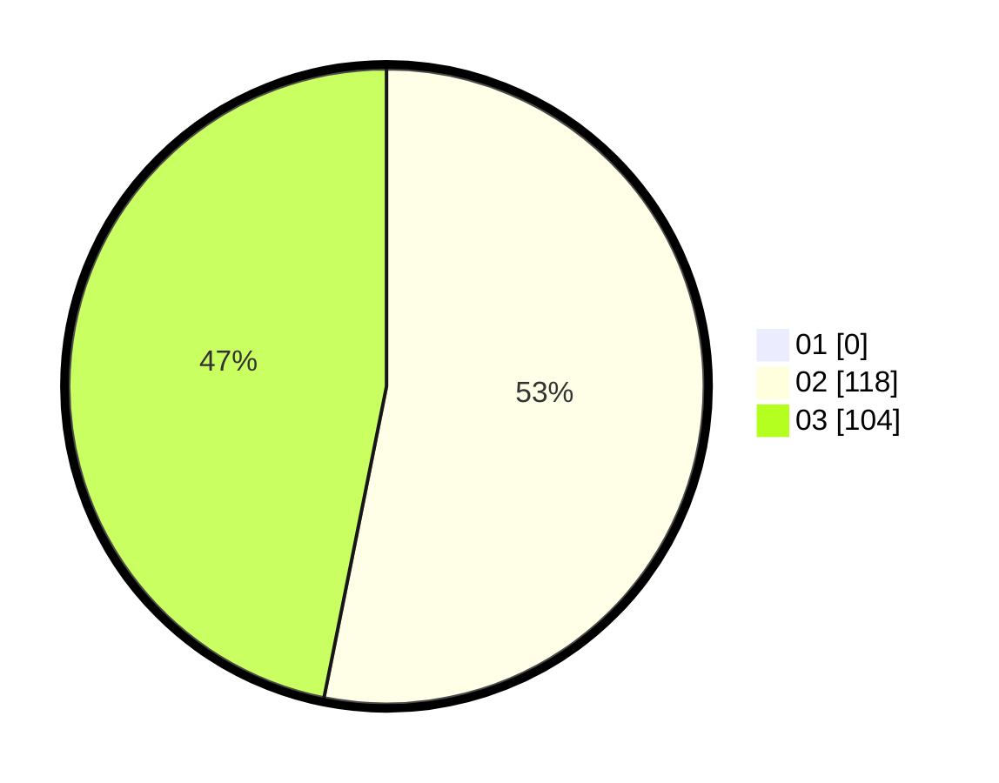

# Hasil

Hasil perolehan suara paslon dapat dilihat pada file paslon-01.txt, paslon-02.txt, dan paslon-03.txt.

Jika tidak ada, artinya data tersebut belum ada pada SIREKAP.

## Perolehan Suara

 * Paslon 01: **0**.
 * Paslon 02: **118**.
 * Paslon 03: **104**.

## Foto C Plano

https://sirekap-obj-formc.kpu.go.id/54cd/pemilu/ppwp/31/73/01/10/01/3173011001223-20240216-042547--bd9d5365-7841-463d-ab3e-c4672105fce4.jpg

https://sirekap-obj-formc.kpu.go.id/54cd/pemilu/ppwp/31/73/01/10/01/3173011001223-20240216-042550--2a65aad2-5399-42f9-887c-84a0b598d79e.jpg

https://sirekap-obj-formc.kpu.go.id/54cd/pemilu/ppwp/31/73/01/10/01/3173011001223-20240216-042548--585591eb-67d7-4a8f-834e-578ef23b25ca.jpg

## DATA PEMILIH TETAP

Jumlah pemilih dalam DPT: **293**.
 * L: **147**.
 * P: **146**.

## DATA PENGGUNA HAK PILIH

Jumlah pengguna hak pilih dalam DPT: **214**.
 * L: **107**.
 * P: **107**.

Jumlah pengguna hak pilih dalam DPTb: **14**.
 * L: **9**.
 * P: **5**.

Jumlah pengguna hak pilih dalam DPK: **2**.
 * L: **1**.
 * P: **1**.

Jumlah pengguna hak pilih: **230**.
 * L: **117**.
 * P: **113**.

## JUMLAH SUARA SAH DAN TIDAK SAH

JUMLAH SELURUH SUARA SAH: **222**.

JUMLAH SUARA TIDAK SAH: **8**.

JUMLAH SELURUH SUARA SAH DAN SUARA TIDAK SAH: **230**.
