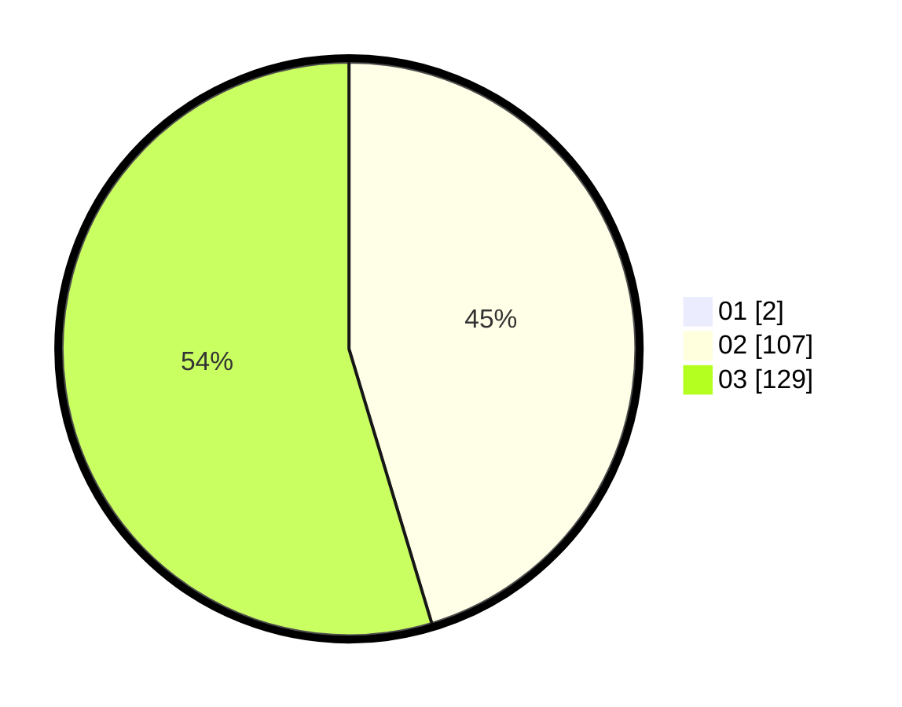

# Hasil

Hasil perolehan suara paslon dapat dilihat pada file paslon-01.txt, paslon-02.txt, dan paslon-03.txt.

Jika tidak ada, artinya data tersebut belum ada pada SIREKAP.

## Perolehan Suara

 * Paslon 01: **2**.
 * Paslon 02: **107**.
 * Paslon 03: **129**.

## Foto C Plano

https://sirekap-obj-formc.kpu.go.id/e72d/pemilu/ppwp/31/73/01/10/01/3173011001225-20240214-222348--64af13f1-b612-474f-b290-d0cc6df526dd.jpg

https://sirekap-obj-formc.kpu.go.id/e72d/pemilu/ppwp/31/73/01/10/01/3173011001225-20240214-222716--de157c31-9b51-4693-b37d-aa5aa3025549.jpg

https://sirekap-obj-formc.kpu.go.id/e72d/pemilu/ppwp/31/73/01/10/01/3173011001225-20240214-224925--bbc792a3-c285-451d-84c0-438e730037c8.jpg
