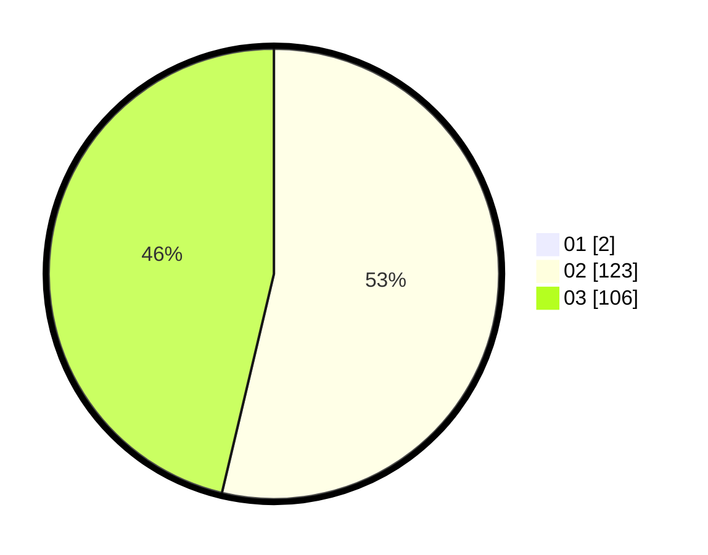

# Hasil

Hasil perolehan suara paslon dapat dilihat pada file paslon-01.txt, paslon-02.txt, dan paslon-03.txt.

Jika tidak ada, artinya data tersebut belum ada pada SIREKAP.

## Perolehan Suara

 * Paslon 01: **2**.
 * Paslon 02: **123**.
 * Paslon 03: **106**.

## Foto C Plano

https://sirekap-obj-formc.kpu.go.id/82ff/pemilu/ppwp/31/73/01/10/01/3173011001227-20240214-202001--70138baf-ff01-49c7-b06a-94ef0909edb2.jpg

https://sirekap-obj-formc.kpu.go.id/82ff/pemilu/ppwp/31/73/01/10/01/3173011001227-20240214-202156--dac14a71-b23f-45d2-9a5c-2309d9a5013f.jpg

https://sirekap-obj-formc.kpu.go.id/82ff/pemilu/ppwp/31/73/01/10/01/3173011001227-20240214-202313--5e4891b7-b843-4432-8248-b44a24ca469e.jpg

## DATA PEMILIH TETAP

Jumlah pemilih dalam DPT: **291**.
 * L: **147**.
 * P: **144**.

## DATA PENGGUNA HAK PILIH

Jumlah pengguna hak pilih dalam DPT: **227**.
 * L: **115**.
 * P: **112**.

Jumlah pengguna hak pilih dalam DPTb: **1**.
 * L: **1**.
 * P: **0**.

Jumlah pengguna hak pilih dalam DPK: **4**.
 * L: **2**.
 * P: **2**.

Jumlah pengguna hak pilih: **232**.
 * L: **118**.
 * P: **114**.

## JUMLAH SUARA SAH DAN TIDAK SAH

JUMLAH SELURUH SUARA SAH: **231**.

JUMLAH SUARA TIDAK SAH: **1**.

JUMLAH SELURUH SUARA SAH DAN SUARA TIDAK SAH: **232**.
