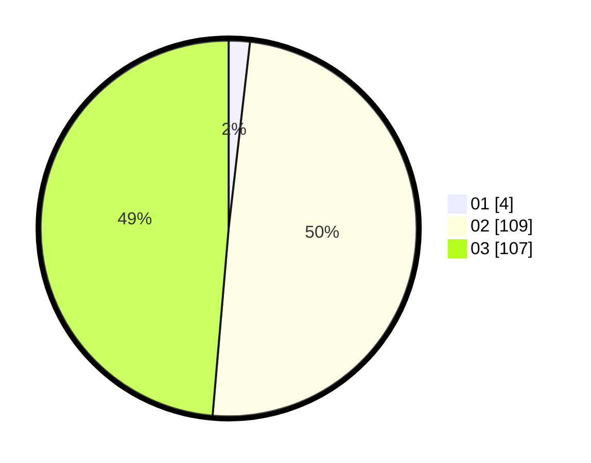

# Hasil

Hasil perolehan suara paslon dapat dilihat pada file paslon-01.txt, paslon-02.txt, dan paslon-03.txt.

Jika tidak ada, artinya data tersebut belum ada pada SIREKAP.

## Perolehan Suara

 * Paslon 01: **4**.
 * Paslon 02: **109**.
 * Paslon 03: **107**.

## Foto C Plano

https://sirekap-obj-formc.kpu.go.id/d26c/pemilu/ppwp/31/73/01/10/01/3173011001228-20240214-194500--3073e2e9-d8df-43ad-92a9-69f0cff23883.jpg

https://sirekap-obj-formc.kpu.go.id/d26c/pemilu/ppwp/31/73/01/10/01/3173011001228-20240214-190109--e3383300-39f6-409e-b989-d218a18c762a.jpg

https://sirekap-obj-formc.kpu.go.id/d26c/pemilu/ppwp/31/73/01/10/01/3173011001228-20240214-190307--fc9b1b45-c7f4-4bcb-b52f-6a9f6c0237e0.jpg

## DATA PEMILIH TETAP

Jumlah pemilih dalam DPT: **289**.
 * L: **136**.
 * P: **153**.

## DATA PENGGUNA HAK PILIH

Jumlah pengguna hak pilih dalam DPT: **217**.
 * L: **101**.
 * P: **116**.

Jumlah pengguna hak pilih dalam DPTb: **6**.
 * L: **3**.
 * P: **3**.

Jumlah pengguna hak pilih dalam DPK: **1**.
 * L: **0**.
 * P: **1**.

Jumlah pengguna hak pilih: **224**.
 * L: **104**.
 * P: **120**.

## JUMLAH SUARA SAH DAN TIDAK SAH

JUMLAH SELURUH SUARA SAH: **220**.

JUMLAH SUARA TIDAK SAH: **4**.

JUMLAH SELURUH SUARA SAH DAN SUARA TIDAK SAH: **224**.
