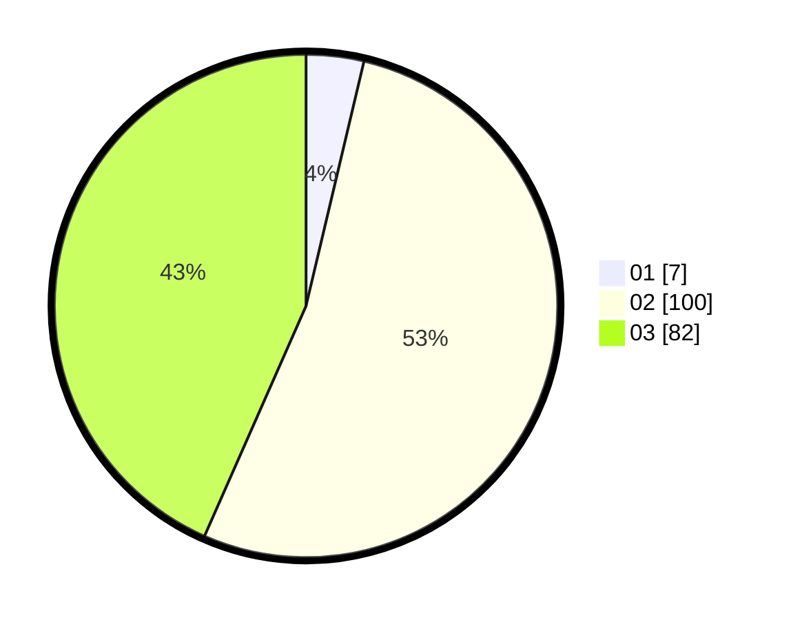

# Hasil

Hasil perolehan suara paslon dapat dilihat pada file paslon-01.txt, paslon-02.txt, dan paslon-03.txt.

Jika tidak ada, artinya data tersebut belum ada pada SIREKAP.

## Perolehan Suara

 * Paslon 01: **7**.
 * Paslon 02: **100**.
 * Paslon 03: **82**.

## Foto C Plano

https://sirekap-obj-formc.kpu.go.id/6740/pemilu/ppwp/31/73/01/10/01/3173011001229-20240214-233709--7e1916fa-acf9-476d-ab72-63011d4aedfc.jpg

https://sirekap-obj-formc.kpu.go.id/6740/pemilu/ppwp/31/73/01/10/01/3173011001229-20240214-205737--b23ec635-1fdf-42d4-bca4-235374c1ea2f.jpg
