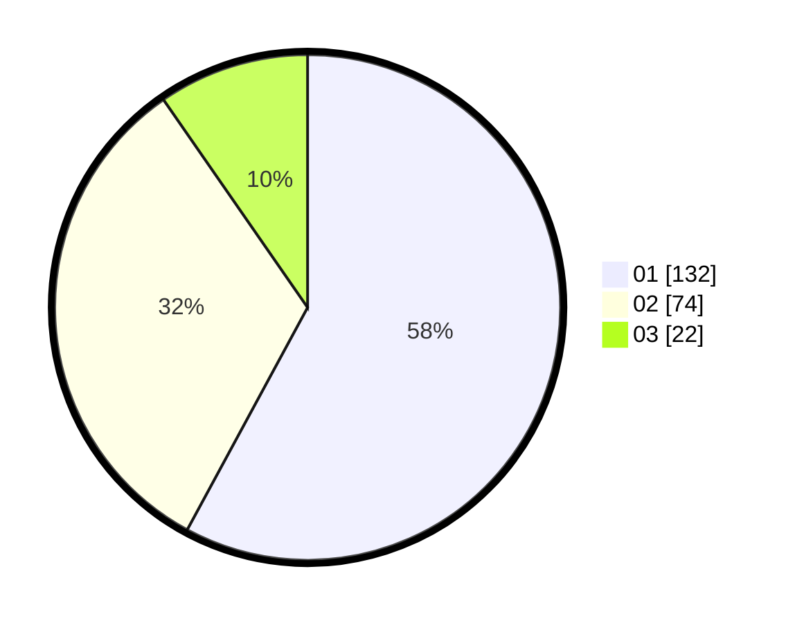

# Hasil

Hasil perolehan suara paslon dapat dilihat pada file paslon-01.txt, paslon-02.txt, dan paslon-03.txt.

Jika tidak ada, artinya data tersebut belum ada pada SIREKAP.

## Perolehan Suara

 * Paslon 01: **132**.
 * Paslon 02: **74**.
 * Paslon 03: **22**.

## Foto C Plano

https://sirekap-obj-formc.kpu.go.id/8123/pemilu/ppwp/31/73/01/10/02/3173011002002-20240215-005947--ad4128fb-95c2-4fbb-8b9e-3fc898ed5b2a.jpg

https://sirekap-obj-formc.kpu.go.id/8123/pemilu/ppwp/31/73/01/10/02/3173011002002-20240215-010121--507df348-4df0-4aa4-b3c9-010a4d3085b3.jpg

https://sirekap-obj-formc.kpu.go.id/8123/pemilu/ppwp/31/73/01/10/02/3173011002002-20240215-010242--b1b39c95-021f-4cac-9c0e-dd1ab54c1ddd.jpg
