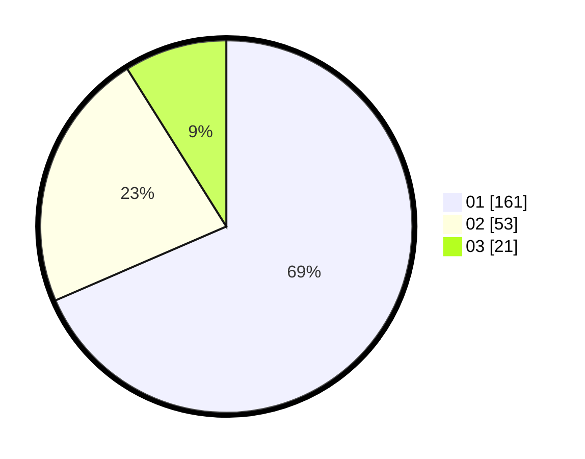

# Hasil

Hasil perolehan suara paslon dapat dilihat pada file paslon-01.txt, paslon-02.txt, dan paslon-03.txt.

Jika tidak ada, artinya data tersebut belum ada pada SIREKAP.

## Perolehan Suara

 * Paslon 01: **161**.
 * Paslon 02: **53**.
 * Paslon 03: **21**.

## Foto C Plano

https://sirekap-obj-formc.kpu.go.id/b693/pemilu/ppwp/31/73/01/10/02/3173011002006-20240214-162245--14142b6a-5205-448d-bb12-10c74800e26b.jpg

https://sirekap-obj-formc.kpu.go.id/b693/pemilu/ppwp/31/73/01/10/02/3173011002006-20240214-190041--cc90aebb-c60d-4e5e-8e96-1268377916ef.jpg

https://sirekap-obj-formc.kpu.go.id/b693/pemilu/ppwp/31/73/01/10/02/3173011002006-20240214-190042--ff2aef5c-d9e8-4b50-9d69-b3b6a88faf17.jpg

## DATA PEMILIH TETAP

Jumlah pemilih dalam DPT: **276**.
 * L: **145**.
 * P: **131**.

## DATA PENGGUNA HAK PILIH

Jumlah pengguna hak pilih dalam DPT: **232**.
 * L: **122**.
 * P: **110**.

Jumlah pengguna hak pilih dalam DPTb: **1**.
 * L: **1**.
 * P: **0**.

Jumlah pengguna hak pilih dalam DPK: **4**.
 * L: **2**.
 * P: **2**.

Jumlah pengguna hak pilih: **237**.
 * L: **125**.
 * P: **112**.

## JUMLAH SUARA SAH DAN TIDAK SAH

JUMLAH SELURUH SUARA SAH: **235**.

JUMLAH SUARA TIDAK SAH: **2**.

JUMLAH SELURUH SUARA SAH DAN SUARA TIDAK SAH: **237**.
