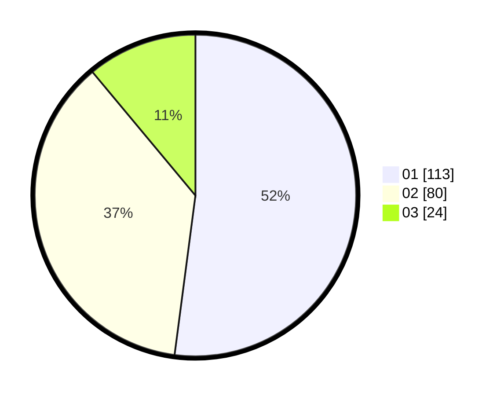

# Hasil

Hasil perolehan suara paslon dapat dilihat pada file paslon-01.txt, paslon-02.txt, dan paslon-03.txt.

Jika tidak ada, artinya data tersebut belum ada pada SIREKAP.

## Perolehan Suara

 * Paslon 01: **113**.
 * Paslon 02: **80**.
 * Paslon 03: **24**.

## Foto C Plano

https://sirekap-obj-formc.kpu.go.id/47f1/pemilu/ppwp/31/73/01/10/02/3173011002010-20240214-204744--aa437343-2c78-4982-8aa6-f4a88f7cb249.jpg

https://sirekap-obj-formc.kpu.go.id/47f1/pemilu/ppwp/31/73/01/10/02/3173011002010-20240214-204836--3cfab7bb-591a-4b5b-bf4d-465910919485.jpg
