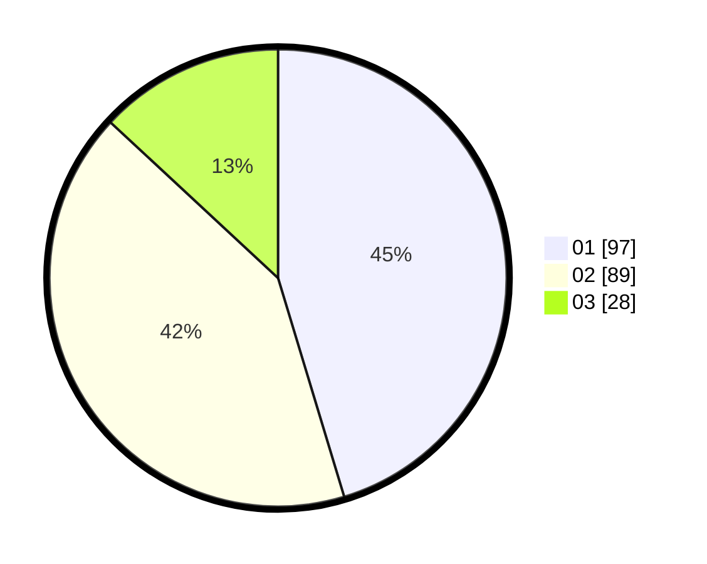

# Hasil

Hasil perolehan suara paslon dapat dilihat pada file paslon-01.txt, paslon-02.txt, dan paslon-03.txt.

Jika tidak ada, artinya data tersebut belum ada pada SIREKAP.

## Perolehan Suara

 * Paslon 01: **97**.
 * Paslon 02: **89**.
 * Paslon 03: **28**.

## Foto C Plano

https://sirekap-obj-formc.kpu.go.id/0cf8/pemilu/ppwp/31/73/01/10/02/3173011002011-20240214-222452--4934a0c4-b495-47cb-a7bf-48ef3b8f7d0e.jpg

https://sirekap-obj-formc.kpu.go.id/0cf8/pemilu/ppwp/31/73/01/10/02/3173011002011-20240214-222654--cc4bc1da-e92f-4e77-85c8-fea8bae8f0b0.jpg

https://sirekap-obj-formc.kpu.go.id/0cf8/pemilu/ppwp/31/73/01/10/02/3173011002011-20240214-223035--7302e56b-d905-4b47-bab9-09b7f37bfaf2.jpg
