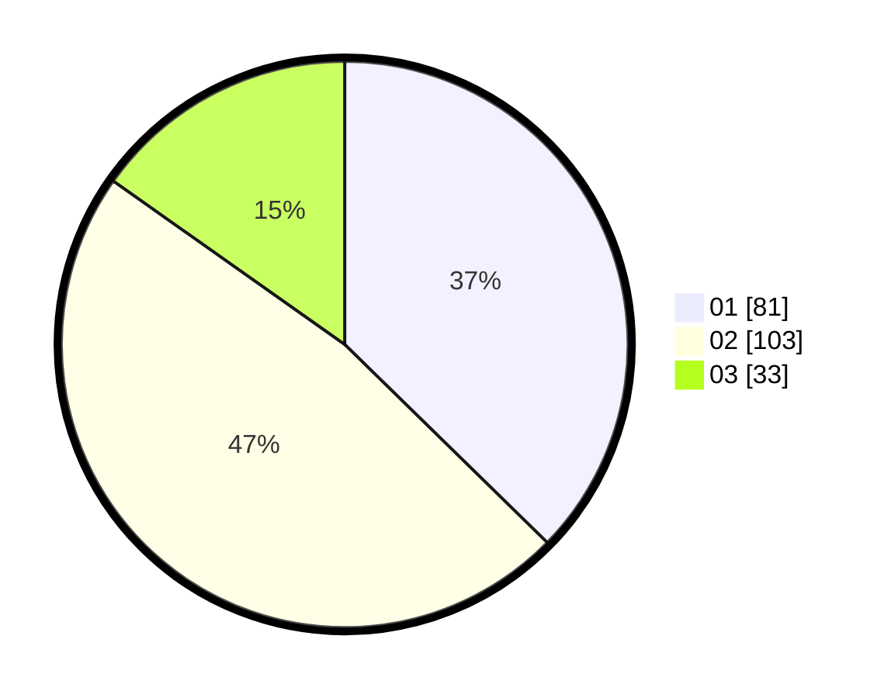

# Hasil

Hasil perolehan suara paslon dapat dilihat pada file paslon-01.txt, paslon-02.txt, dan paslon-03.txt.

Jika tidak ada, artinya data tersebut belum ada pada SIREKAP.

## Perolehan Suara

 * Paslon 01: **81**.
 * Paslon 02: **103**.
 * Paslon 03: **33**.

## Foto C Plano

https://sirekap-obj-formc.kpu.go.id/ebc7/pemilu/ppwp/31/73/01/10/02/3173011002016-20240214-233737--4e040bbe-0e44-435b-969f-cb7567142b31.jpg

https://sirekap-obj-formc.kpu.go.id/ebc7/pemilu/ppwp/31/73/01/10/02/3173011002016-20240214-233902--3a479dbc-df60-4626-bc13-4c709a16e206.jpg

https://sirekap-obj-formc.kpu.go.id/ebc7/pemilu/ppwp/31/73/01/10/02/3173011002016-20240215-003635--dbb8bb53-6821-40dc-b15b-3a3388e2d362.jpg
