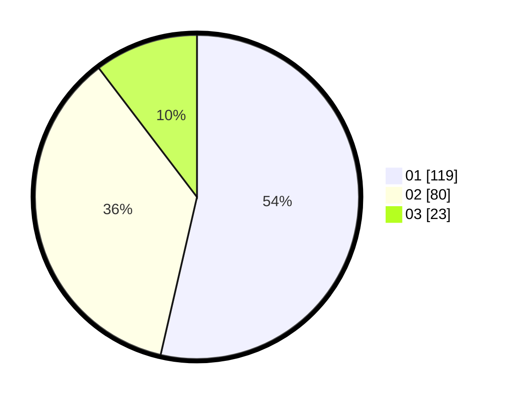

# Hasil

Hasil perolehan suara paslon dapat dilihat pada file paslon-01.txt, paslon-02.txt, dan paslon-03.txt.

Jika tidak ada, artinya data tersebut belum ada pada SIREKAP.

## Perolehan Suara

 * Paslon 01: **119**.
 * Paslon 02: **80**.
 * Paslon 03: **23**.

## Foto C Plano

https://sirekap-obj-formc.kpu.go.id/e9cf/pemilu/ppwp/31/73/01/10/02/3173011002020-20240215-065449--44deaad2-9ca9-4b0a-aac2-596a3c3fc46a.jpg

https://sirekap-obj-formc.kpu.go.id/e9cf/pemilu/ppwp/31/73/01/10/02/3173011002020-20240215-065543--3a497361-3ad6-4a82-aaad-7fecf3e323de.jpg

https://sirekap-obj-formc.kpu.go.id/e9cf/pemilu/ppwp/31/73/01/10/02/3173011002020-20240215-071041--4bb1a762-2333-483c-b562-5a4b5577acec.jpg
