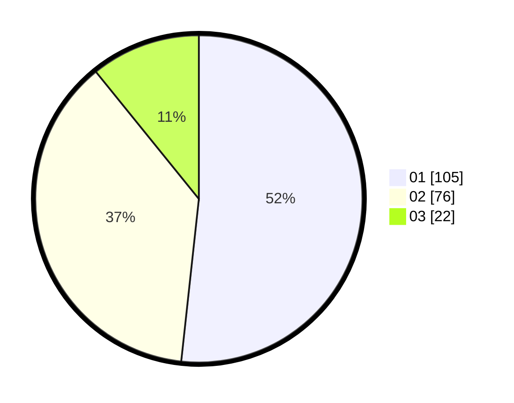

# Hasil

Hasil perolehan suara paslon dapat dilihat pada file paslon-01.txt, paslon-02.txt, dan paslon-03.txt.

Jika tidak ada, artinya data tersebut belum ada pada SIREKAP.

## Perolehan Suara

 * Paslon 01: **105**.
 * Paslon 02: **76**.
 * Paslon 03: **22**.

## Foto C Plano

https://sirekap-obj-formc.kpu.go.id/30ca/pemilu/ppwp/31/73/01/10/02/3173011002024-20240215-170851--4587fa0e-86a6-489b-9103-899a2224b5a0.jpg

https://sirekap-obj-formc.kpu.go.id/30ca/pemilu/ppwp/31/73/01/10/02/3173011002024-20240215-171029--e6c1d246-dabe-4825-91d3-7c5cf5cfce9c.jpg

https://sirekap-obj-formc.kpu.go.id/30ca/pemilu/ppwp/31/73/01/10/02/3173011002024-20240215-171138--347737c2-f23d-4442-a7ab-58d91c270d8b.jpg
