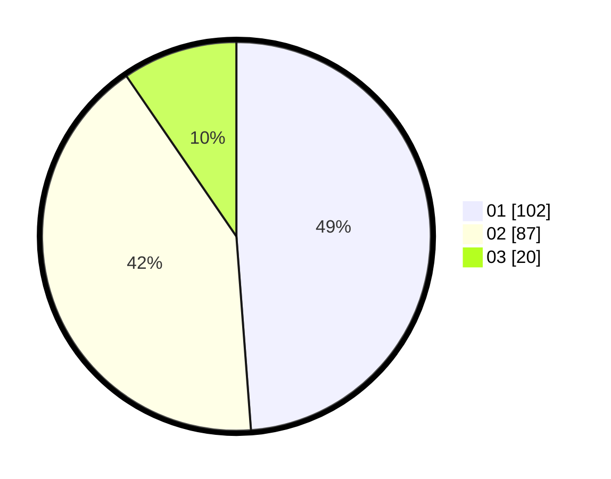

# Hasil

Hasil perolehan suara paslon dapat dilihat pada file paslon-01.txt, paslon-02.txt, dan paslon-03.txt.

Jika tidak ada, artinya data tersebut belum ada pada SIREKAP.

## Perolehan Suara

 * Paslon 01: **102**.
 * Paslon 02: **87**.
 * Paslon 03: **20**.

## Foto C Plano

https://sirekap-obj-formc.kpu.go.id/5fcd/pemilu/ppwp/31/73/01/10/02/3173011002025-20240216-121046--4d794b73-ecd8-4634-953d-046fc917534f.jpg

https://sirekap-obj-formc.kpu.go.id/5fcd/pemilu/ppwp/31/73/01/10/02/3173011002025-20240216-121047--d0b60ce8-a21d-4868-bcb1-7c7da8ed3e4d.jpg

https://sirekap-obj-formc.kpu.go.id/5fcd/pemilu/ppwp/31/73/01/10/02/3173011002025-20240216-121047--b0f7fb0b-79e7-4066-a8f5-e5f17c87786b.jpg

## DATA PEMILIH TETAP

Jumlah pemilih dalam DPT: **267**.
 * L: **138**.
 * P: **129**.

## DATA PENGGUNA HAK PILIH

Jumlah pengguna hak pilih dalam DPT: **198**.
 * L: **97**.
 * P: **101**.

Jumlah pengguna hak pilih dalam DPTb: **12**.
 * L: **4**.
 * P: **8**.

Jumlah pengguna hak pilih dalam DPK: **3**.
 * L: **2**.
 * P: **1**.

Jumlah pengguna hak pilih: **213**.
 * L: **103**.
 * P: **110**.

## JUMLAH SUARA SAH DAN TIDAK SAH

JUMLAH SELURUH SUARA SAH: **209**.

JUMLAH SUARA TIDAK SAH: **4**.

JUMLAH SELURUH SUARA SAH DAN SUARA TIDAK SAH: **213**.
