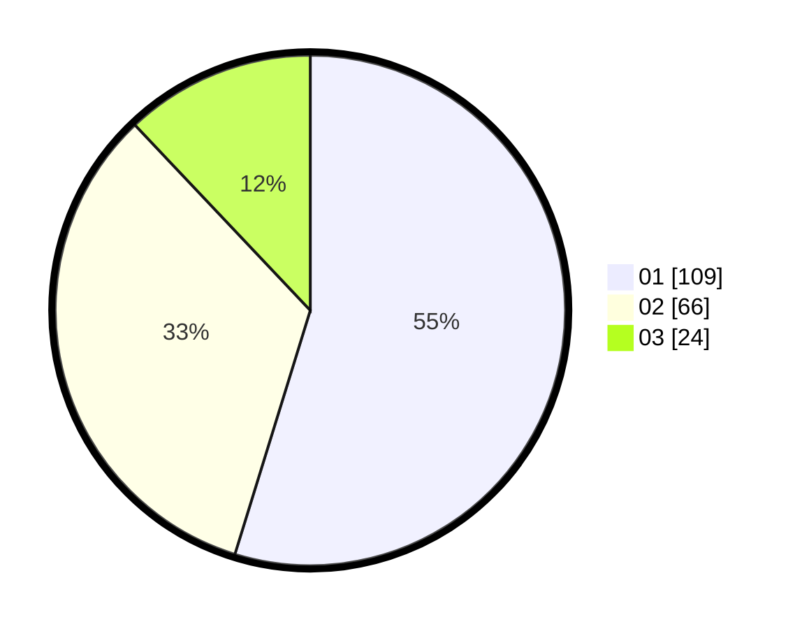

# Hasil

Hasil perolehan suara paslon dapat dilihat pada file paslon-01.txt, paslon-02.txt, dan paslon-03.txt.

Jika tidak ada, artinya data tersebut belum ada pada SIREKAP.

## Perolehan Suara

 * Paslon 01: **109**.
 * Paslon 02: **66**.
 * Paslon 03: **24**.

## Foto C Plano

https://sirekap-obj-formc.kpu.go.id/7573/pemilu/ppwp/31/73/01/10/02/3173011002028-20240216-133116--82a45efa-edab-44aa-a21c-f9dbf2968290.jpg

https://sirekap-obj-formc.kpu.go.id/7573/pemilu/ppwp/31/73/01/10/02/3173011002028-20240216-133118--e8e96e49-a71b-4a67-8bca-b5485eb89006.jpg

https://sirekap-obj-formc.kpu.go.id/7573/pemilu/ppwp/31/73/01/10/02/3173011002028-20240216-133117--22197dae-588a-48e5-81f4-066782809fde.jpg

## DATA PEMILIH TETAP

Jumlah pemilih dalam DPT: **269**.
 * L: **138**.
 * P: **131**.

## DATA PENGGUNA HAK PILIH

Jumlah pengguna hak pilih dalam DPT: **198**.
 * L: **97**.
 * P: **101**.

Jumlah pengguna hak pilih dalam DPTb: **0**.
 * L: **0**.
 * P: **0**.

Jumlah pengguna hak pilih dalam DPK: **2**.
 * L: **1**.
 * P: **1**.

Jumlah pengguna hak pilih: **200**.
 * L: **98**.
 * P: **102**.

## JUMLAH SUARA SAH DAN TIDAK SAH

JUMLAH SELURUH SUARA SAH: **199**.

JUMLAH SUARA TIDAK SAH: **1**.

JUMLAH SELURUH SUARA SAH DAN SUARA TIDAK SAH: **200**.
