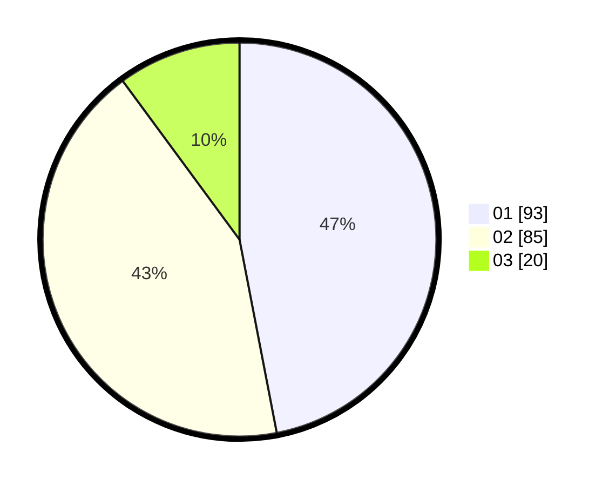

# Hasil

Hasil perolehan suara paslon dapat dilihat pada file paslon-01.txt, paslon-02.txt, dan paslon-03.txt.

Jika tidak ada, artinya data tersebut belum ada pada SIREKAP.

## Perolehan Suara

 * Paslon 01: **93**.
 * Paslon 02: **85**.
 * Paslon 03: **20**.

## Foto C Plano

https://sirekap-obj-formc.kpu.go.id/9566/pemilu/ppwp/31/73/01/10/02/3173011002031-20240216-134052--3788a6e2-1ced-4485-9f98-7c2810d49c98.jpg

https://sirekap-obj-formc.kpu.go.id/9566/pemilu/ppwp/31/73/01/10/02/3173011002031-20240216-134053--742e0629-8319-49c3-84fa-09bcdd75e398.jpg

https://sirekap-obj-formc.kpu.go.id/9566/pemilu/ppwp/31/73/01/10/02/3173011002031-20240216-134053--484152a9-604f-4113-b0cb-e11a2866fdfd.jpg

## DATA PEMILIH TETAP

Jumlah pemilih dalam DPT: **273**.
 * L: **138**.
 * P: **135**.

## DATA PENGGUNA HAK PILIH

Jumlah pengguna hak pilih dalam DPT: **185**.
 * L: **91**.
 * P: **94**.

Jumlah pengguna hak pilih dalam DPTb: **4**.
 * L: **3**.
 * P: **1**.

Jumlah pengguna hak pilih dalam DPK: **9**.
 * L: **4**.
 * P: **5**.

Jumlah pengguna hak pilih: **198**.
 * L: **98**.
 * P: **100**.

## JUMLAH SUARA SAH DAN TIDAK SAH

JUMLAH SELURUH SUARA SAH: **198**.

JUMLAH SUARA TIDAK SAH: **3**.

JUMLAH SELURUH SUARA SAH DAN SUARA TIDAK SAH: **201**.
