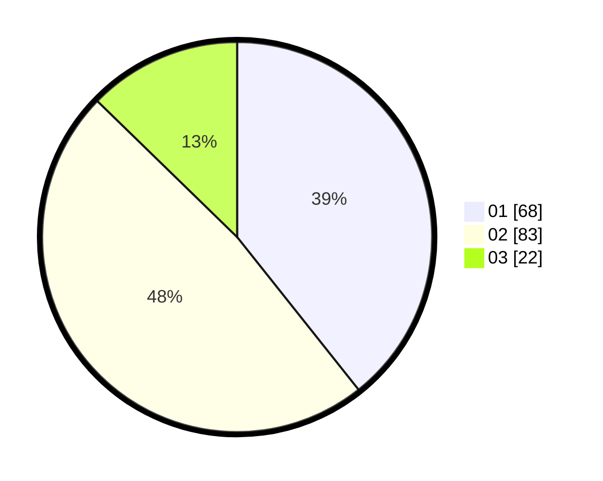

# Hasil

Hasil perolehan suara paslon dapat dilihat pada file paslon-01.txt, paslon-02.txt, dan paslon-03.txt.

Jika tidak ada, artinya data tersebut belum ada pada SIREKAP.

## Perolehan Suara

 * Paslon 01: **68**.
 * Paslon 02: **83**.
 * Paslon 03: **22**.

## Foto C Plano

https://sirekap-obj-formc.kpu.go.id/e83a/pemilu/ppwp/31/73/01/10/02/3173011002033-20240216-061612--cfc3eeff-5e19-46dd-b115-8df624202695.jpg

https://sirekap-obj-formc.kpu.go.id/e83a/pemilu/ppwp/31/73/01/10/02/3173011002033-20240216-061628--3128ca7d-11c9-4e38-890b-56b87f0b3e4a.jpg

https://sirekap-obj-formc.kpu.go.id/e83a/pemilu/ppwp/31/73/01/10/02/3173011002033-20240216-061743--1be3251f-522f-4e42-844b-059c4cc42645.jpg

## DATA PEMILIH TETAP

Jumlah pemilih dalam DPT: **259**.
 * L: **130**.
 * P: **129**.

## DATA PENGGUNA HAK PILIH

Jumlah pengguna hak pilih dalam DPT: **180**.
 * L: **88**.
 * P: **92**.

Jumlah pengguna hak pilih dalam DPTb: **0**.
 * L: **0**.
 * P: **0**.

Jumlah pengguna hak pilih dalam DPK: **0**.
 * L: **0**.
 * P: **0**.

Jumlah pengguna hak pilih: **180**.
 * L: **88**.
 * P: **92**.

## JUMLAH SUARA SAH DAN TIDAK SAH

JUMLAH SELURUH SUARA SAH: **173**.

JUMLAH SUARA TIDAK SAH: **7**.

JUMLAH SELURUH SUARA SAH DAN SUARA TIDAK SAH: **180**.
