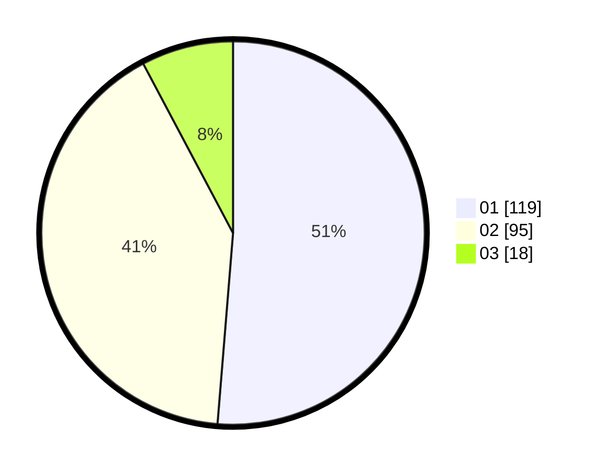

# Hasil

Hasil perolehan suara paslon dapat dilihat pada file paslon-01.txt, paslon-02.txt, dan paslon-03.txt.

Jika tidak ada, artinya data tersebut belum ada pada SIREKAP.

## Perolehan Suara

 * Paslon 01: **119**.
 * Paslon 02: **95**.
 * Paslon 03: **18**.

## Foto C Plano

https://sirekap-obj-formc.kpu.go.id/c9f5/pemilu/ppwp/31/73/01/10/02/3173011002036-20240214-233711--4e387c54-bab4-46f5-800c-36614accda05.jpg

https://sirekap-obj-formc.kpu.go.id/c9f5/pemilu/ppwp/31/73/01/10/02/3173011002036-20240214-233946--b812ad14-82f6-453d-8459-8fd266d4201b.jpg

https://sirekap-obj-formc.kpu.go.id/c9f5/pemilu/ppwp/31/73/01/10/02/3173011002036-20240214-234058--a920a534-dc52-4e70-b5c7-5eaf78a0be3e.jpg
