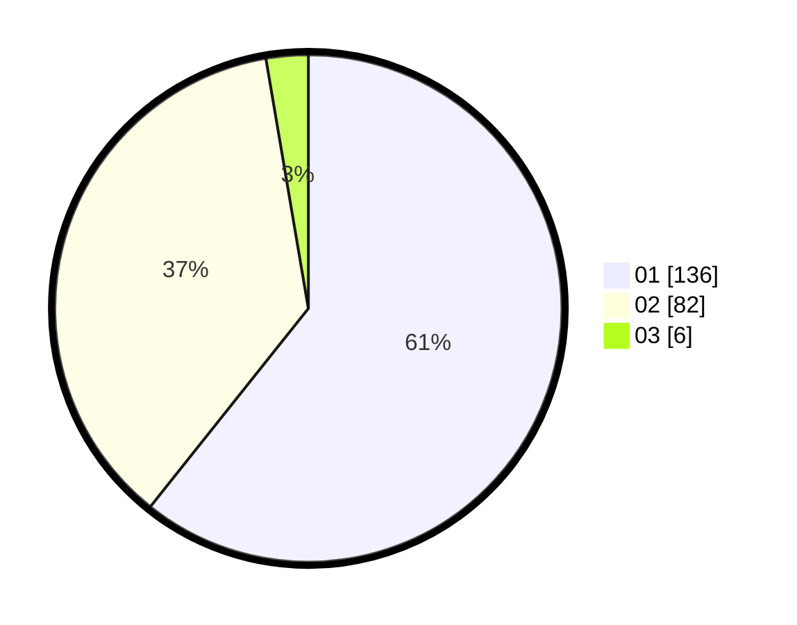

# Hasil

Hasil perolehan suara paslon dapat dilihat pada file paslon-01.txt, paslon-02.txt, dan paslon-03.txt.

Jika tidak ada, artinya data tersebut belum ada pada SIREKAP.

## Perolehan Suara

 * Paslon 01: **136**.
 * Paslon 02: **82**.
 * Paslon 03: **6**.

## Foto C Plano

https://sirekap-obj-formc.kpu.go.id/8d55/pemilu/ppwp/31/73/01/10/02/3173011002040-20240214-215516--163bc10e-42c5-4b3f-b396-bb52eb55ca85.jpg

https://sirekap-obj-formc.kpu.go.id/8d55/pemilu/ppwp/31/73/01/10/02/3173011002040-20240216-140037--fc02e2c5-3a5e-483e-9ee3-eb3931637ad1.jpg

https://sirekap-obj-formc.kpu.go.id/8d55/pemilu/ppwp/31/73/01/10/02/3173011002040-20240216-140036--2427666c-0f7a-46ca-bfd1-3c3ec85a8c11.jpg
