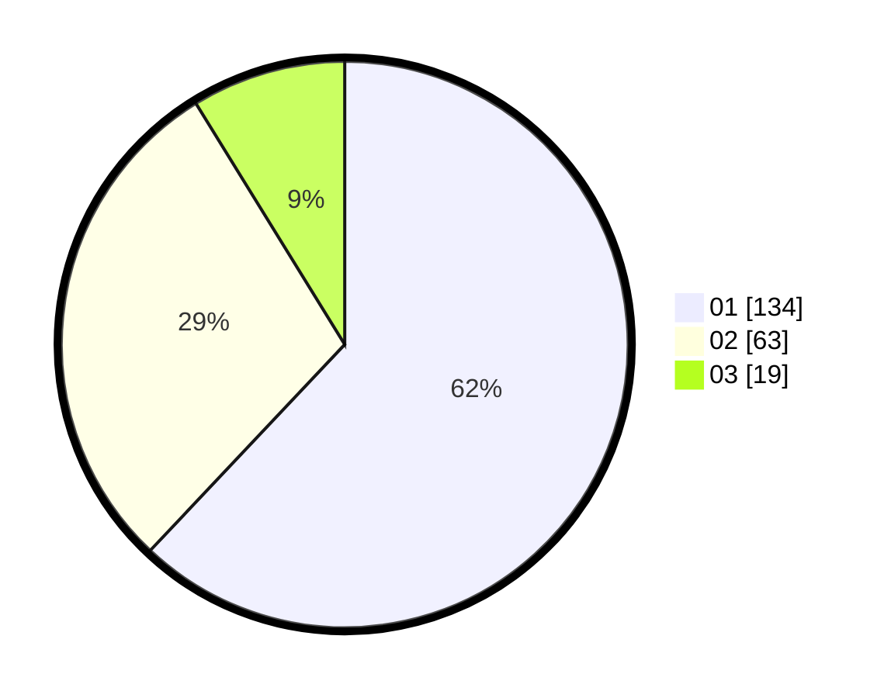

# Hasil

Hasil perolehan suara paslon dapat dilihat pada file paslon-01.txt, paslon-02.txt, dan paslon-03.txt.

Jika tidak ada, artinya data tersebut belum ada pada SIREKAP.

## Perolehan Suara

 * Paslon 01: **134**.
 * Paslon 02: **63**.
 * Paslon 03: **19**.

## Foto C Plano

https://sirekap-obj-formc.kpu.go.id/1435/pemilu/ppwp/31/73/01/10/02/3173011002044-20240216-140536--d775e3cc-d895-4356-bf3e-e47819551446.jpg

https://sirekap-obj-formc.kpu.go.id/1435/pemilu/ppwp/31/73/01/10/02/3173011002044-20240216-140538--f6680340-d055-479e-bb88-d1ce37933813.jpg

https://sirekap-obj-formc.kpu.go.id/1435/pemilu/ppwp/31/73/01/10/02/3173011002044-20240216-140537--02aa8599-2846-4ef4-a114-1a97a68fabda.jpg

## DATA PEMILIH TETAP

Jumlah pemilih dalam DPT: **269**.
 * L: **135**.
 * P: **134**.

## DATA PENGGUNA HAK PILIH

Jumlah pengguna hak pilih dalam DPT: **219**.
 * L: **115**.
 * P: **104**.

Jumlah pengguna hak pilih dalam DPTb: **1**.
 * L: **1**.
 * P: **0**.

Jumlah pengguna hak pilih dalam DPK: **1**.
 * L: **0**.
 * P: **1**.

Jumlah pengguna hak pilih: **221**.
 * L: **116**.
 * P: **105**.

## JUMLAH SUARA SAH DAN TIDAK SAH

JUMLAH SELURUH SUARA SAH: **216**.

JUMLAH SUARA TIDAK SAH: **5**.

JUMLAH SELURUH SUARA SAH DAN SUARA TIDAK SAH: **221**.
