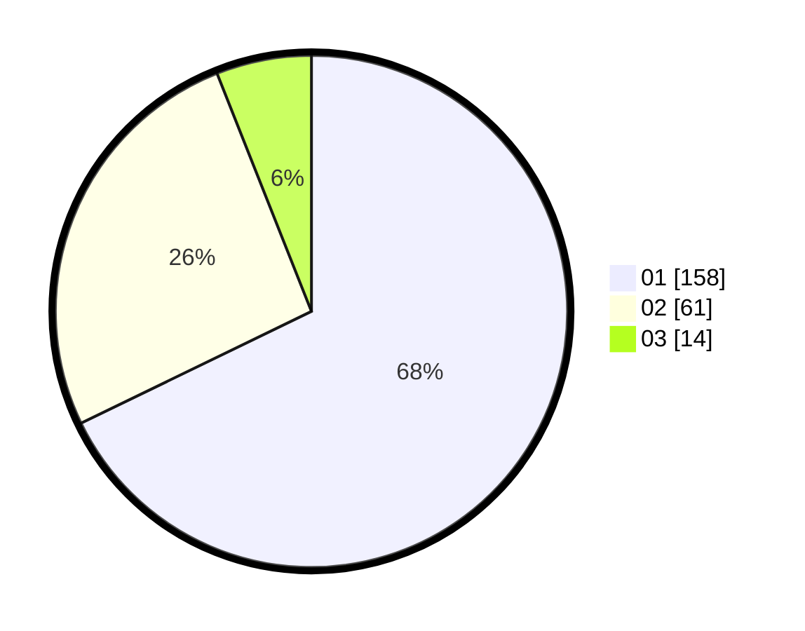

# Hasil

Hasil perolehan suara paslon dapat dilihat pada file paslon-01.txt, paslon-02.txt, dan paslon-03.txt.

Jika tidak ada, artinya data tersebut belum ada pada SIREKAP.

## Perolehan Suara

 * Paslon 01: **158**.
 * Paslon 02: **61**.
 * Paslon 03: **14**.

## Foto C Plano

https://sirekap-obj-formc.kpu.go.id/ddf3/pemilu/ppwp/31/73/01/10/02/3173011002045-20240216-132327--1cc2d2ce-7fa9-4bd9-a476-5453fc91cfb6.jpg

https://sirekap-obj-formc.kpu.go.id/ddf3/pemilu/ppwp/31/73/01/10/02/3173011002045-20240216-132328--a7d498d7-059f-47c3-b028-729718f1f0e3.jpg

https://sirekap-obj-formc.kpu.go.id/ddf3/pemilu/ppwp/31/73/01/10/02/3173011002045-20240216-132328--0450ab94-6aa6-44d1-a3fd-cd75753c7132.jpg

## DATA PEMILIH TETAP

Jumlah pemilih dalam DPT: **276**.
 * L: **139**.
 * P: **137**.

## DATA PENGGUNA HAK PILIH

Jumlah pengguna hak pilih dalam DPT: **231**.
 * L: **117**.
 * P: **114**.

Jumlah pengguna hak pilih dalam DPTb: **1**.
 * L: **1**.
 * P: **0**.

Jumlah pengguna hak pilih dalam DPK: **2**.
 * L: **1**.
 * P: **1**.

Jumlah pengguna hak pilih: **234**.
 * L: **119**.
 * P: **115**.

## JUMLAH SUARA SAH DAN TIDAK SAH

JUMLAH SELURUH SUARA SAH: **233**.

JUMLAH SUARA TIDAK SAH: **1**.

JUMLAH SELURUH SUARA SAH DAN SUARA TIDAK SAH: **234**.
