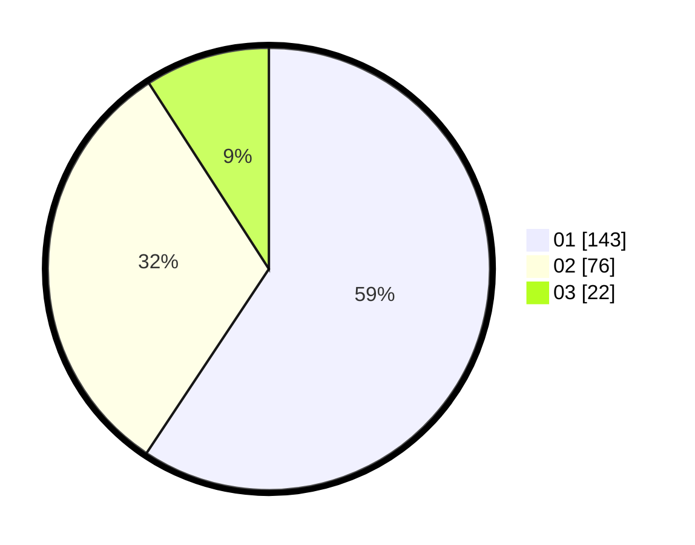

# Hasil

Hasil perolehan suara paslon dapat dilihat pada file paslon-01.txt, paslon-02.txt, dan paslon-03.txt.

Jika tidak ada, artinya data tersebut belum ada pada SIREKAP.

## Perolehan Suara

 * Paslon 01: **143**.
 * Paslon 02: **76**.
 * Paslon 03: **22**.

## Foto C Plano

https://sirekap-obj-formc.kpu.go.id/9764/pemilu/ppwp/31/73/01/10/02/3173011002046-20240216-145536--f196383b-b4d5-4d6b-ad96-960aaf15d85e.jpg

https://sirekap-obj-formc.kpu.go.id/9764/pemilu/ppwp/31/73/01/10/02/3173011002046-20240216-145538--53a1d89b-8764-4e57-a45b-13becc0620d3.jpg

https://sirekap-obj-formc.kpu.go.id/9764/pemilu/ppwp/31/73/01/10/02/3173011002046-20240216-145537--4537c128-0b45-4842-a6db-8f0d36e4afa4.jpg

## DATA PEMILIH TETAP

Jumlah pemilih dalam DPT: **270**.
 * L: **133**.
 * P: **137**.

## DATA PENGGUNA HAK PILIH

Jumlah pengguna hak pilih dalam DPT: **232**.
 * L: **117**.
 * P: **115**.

Jumlah pengguna hak pilih dalam DPTb: **7**.
 * L: **5**.
 * P: **2**.

Jumlah pengguna hak pilih dalam DPK: **3**.
 * L: **2**.
 * P: **1**.

Jumlah pengguna hak pilih: **242**.
 * L: **124**.
 * P: **118**.

## JUMLAH SUARA SAH DAN TIDAK SAH

JUMLAH SELURUH SUARA SAH: **241**.

JUMLAH SUARA TIDAK SAH: **1**.

JUMLAH SELURUH SUARA SAH DAN SUARA TIDAK SAH: **242**.
