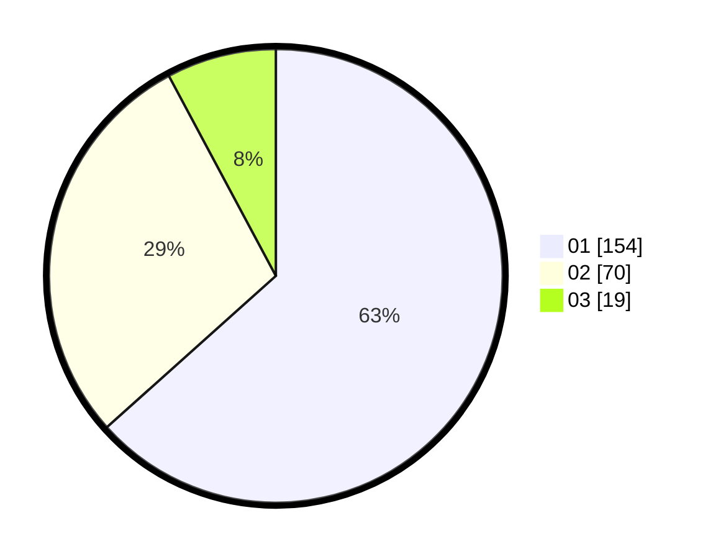

# Hasil

Hasil perolehan suara paslon dapat dilihat pada file paslon-01.txt, paslon-02.txt, dan paslon-03.txt.

Jika tidak ada, artinya data tersebut belum ada pada SIREKAP.

## Perolehan Suara

 * Paslon 01: **154**.
 * Paslon 02: **70**.
 * Paslon 03: **19**.

## Foto C Plano

https://sirekap-obj-formc.kpu.go.id/3b2b/pemilu/ppwp/31/73/01/10/02/3173011002049-20240214-191637--f28fac54-fbd7-4e8d-8f33-a1b738d92e9c.jpg

https://sirekap-obj-formc.kpu.go.id/3b2b/pemilu/ppwp/31/73/01/10/02/3173011002049-20240216-141606--be0c9339-1e03-4769-a827-de3b27c7124a.jpg

https://sirekap-obj-formc.kpu.go.id/3b2b/pemilu/ppwp/31/73/01/10/02/3173011002049-20240214-190018--7b877231-ae37-436e-aec6-12a37e343e2c.jpg

## DATA PEMILIH TETAP

Jumlah pemilih dalam DPT: **271**.
 * L: **134**.
 * P: **137**.

## DATA PENGGUNA HAK PILIH

Jumlah pengguna hak pilih dalam DPT: **240**.
 * L: **119**.
 * P: **121**.

Jumlah pengguna hak pilih dalam DPTb: **1**.
 * L: **0**.
 * P: **1**.

Jumlah pengguna hak pilih dalam DPK: **4**.
 * L: **2**.
 * P: **2**.

Jumlah pengguna hak pilih: **245**.
 * L: **121**.
 * P: **124**.

## JUMLAH SUARA SAH DAN TIDAK SAH

JUMLAH SELURUH SUARA SAH: **243**.

JUMLAH SUARA TIDAK SAH: **2**.

JUMLAH SELURUH SUARA SAH DAN SUARA TIDAK SAH: **245**.
