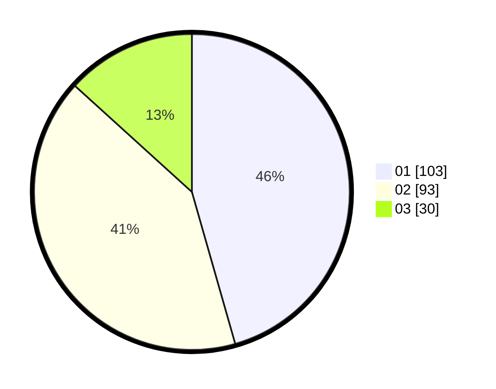

# Hasil

Hasil perolehan suara paslon dapat dilihat pada file paslon-01.txt, paslon-02.txt, dan paslon-03.txt.

Jika tidak ada, artinya data tersebut belum ada pada SIREKAP.

## Perolehan Suara

 * Paslon 01: **103**.
 * Paslon 02: **93**.
 * Paslon 03: **30**.

## Foto C Plano

https://sirekap-obj-formc.kpu.go.id/7a25/pemilu/ppwp/31/73/01/10/02/3173011002050-20240215-160106--db5b8330-9508-4ee3-a6b1-11b5c50a25ac.jpg

https://sirekap-obj-formc.kpu.go.id/7a25/pemilu/ppwp/31/73/01/10/02/3173011002050-20240215-133833--f424b016-8325-43a7-b715-31c4033659ba.jpg

https://sirekap-obj-formc.kpu.go.id/7a25/pemilu/ppwp/31/73/01/10/02/3173011002050-20240215-134037--61aa1885-cfa8-4d34-aeae-5f1284efa160.jpg

## DATA PEMILIH TETAP

Jumlah pemilih dalam DPT: **273**.
 * L: **126**.
 * P: **147**.

## DATA PENGGUNA HAK PILIH

Jumlah pengguna hak pilih dalam DPT: **202**.
 * L: **98**.
 * P: **104**.

Jumlah pengguna hak pilih dalam DPTb: **17**.
 * L: **7**.
 * P: **10**.

Jumlah pengguna hak pilih dalam DPK: **12**.
 * L: **4**.
 * P: **8**.

Jumlah pengguna hak pilih: **231**.
 * L: **109**.
 * P: **122**.

## JUMLAH SUARA SAH DAN TIDAK SAH

JUMLAH SELURUH SUARA SAH: **226**.

JUMLAH SUARA TIDAK SAH: **5**.

JUMLAH SELURUH SUARA SAH DAN SUARA TIDAK SAH: **231**.
