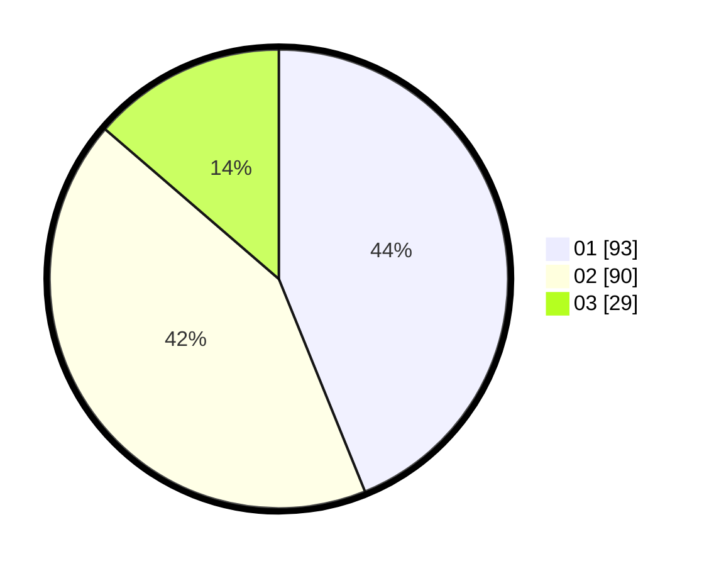

# Hasil

Hasil perolehan suara paslon dapat dilihat pada file paslon-01.txt, paslon-02.txt, dan paslon-03.txt.

Jika tidak ada, artinya data tersebut belum ada pada SIREKAP.

## Perolehan Suara

 * Paslon 01: **93**.
 * Paslon 02: **90**.
 * Paslon 03: **29**.

## Foto C Plano

https://sirekap-obj-formc.kpu.go.id/b5d8/pemilu/ppwp/31/73/01/10/02/3173011002059-20240216-133550--ca897fcc-3b4b-4a3c-a339-79119bca0775.jpg

https://sirekap-obj-formc.kpu.go.id/b5d8/pemilu/ppwp/31/73/01/10/02/3173011002059-20240216-133551--7f8998f1-bac5-4f87-b818-a78661381d41.jpg

https://sirekap-obj-formc.kpu.go.id/b5d8/pemilu/ppwp/31/73/01/10/02/3173011002059-20240216-133550--852c4d94-0c20-4fab-985a-166ee16fe388.jpg

## DATA PEMILIH TETAP

Jumlah pemilih dalam DPT: **274**.
 * L: **104**.
 * P: **170**.

## DATA PENGGUNA HAK PILIH

Jumlah pengguna hak pilih dalam DPT: **213**.
 * L: **103**.
 * P: **110**.

Jumlah pengguna hak pilih dalam DPTb: **1**.
 * L: **1**.
 * P: **0**.

Jumlah pengguna hak pilih dalam DPK: **0**.
 * L: **0**.
 * P: **0**.

Jumlah pengguna hak pilih: **214**.
 * L: **104**.
 * P: **110**.

## JUMLAH SUARA SAH DAN TIDAK SAH

JUMLAH SELURUH SUARA SAH: **212**.

JUMLAH SUARA TIDAK SAH: **2**.

JUMLAH SELURUH SUARA SAH DAN SUARA TIDAK SAH: **214**.
