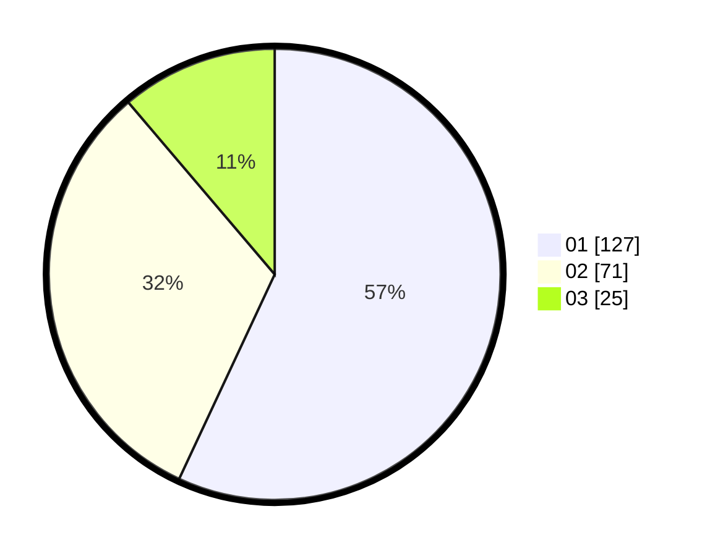

# Hasil

Hasil perolehan suara paslon dapat dilihat pada file paslon-01.txt, paslon-02.txt, dan paslon-03.txt.

Jika tidak ada, artinya data tersebut belum ada pada SIREKAP.

## Perolehan Suara

 * Paslon 01: **127**.
 * Paslon 02: **71**.
 * Paslon 03: **25**.

## Foto C Plano

https://sirekap-obj-formc.kpu.go.id/f574/pemilu/ppwp/31/73/01/10/02/3173011002061-20240216-144823--9aeab9b4-9a53-4c13-b082-238f2c322af9.jpg

https://sirekap-obj-formc.kpu.go.id/f574/pemilu/ppwp/31/73/01/10/02/3173011002061-20240216-144825--36688dbc-2740-4f5d-84d1-709658e2abd7.jpg

https://sirekap-obj-formc.kpu.go.id/f574/pemilu/ppwp/31/73/01/10/02/3173011002061-20240216-144824--897adeca-d07f-43bd-a97d-ddca5b966c4d.jpg

## DATA PEMILIH TETAP

Jumlah pemilih dalam DPT: **270**.
 * L: **135**.
 * P: **135**.

## DATA PENGGUNA HAK PILIH

Jumlah pengguna hak pilih dalam DPT: **221**.
 * L: **111**.
 * P: **110**.

Jumlah pengguna hak pilih dalam DPTb: **0**.
 * L: **0**.
 * P: **0**.

Jumlah pengguna hak pilih dalam DPK: **5**.
 * L: **2**.
 * P: **3**.

Jumlah pengguna hak pilih: **226**.
 * L: **113**.
 * P: **113**.

## JUMLAH SUARA SAH DAN TIDAK SAH

JUMLAH SELURUH SUARA SAH: **223**.

JUMLAH SUARA TIDAK SAH: **3**.

JUMLAH SELURUH SUARA SAH DAN SUARA TIDAK SAH: **226**.
