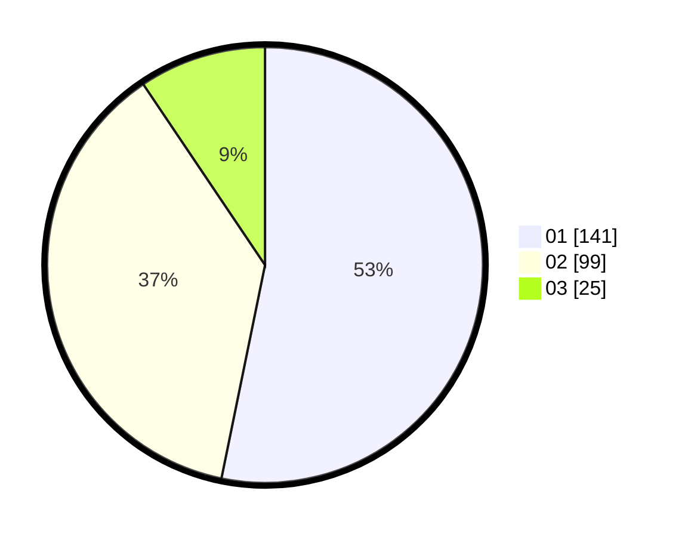

# Hasil

Hasil perolehan suara paslon dapat dilihat pada file paslon-01.txt, paslon-02.txt, dan paslon-03.txt.

Jika tidak ada, artinya data tersebut belum ada pada SIREKAP.

## Perolehan Suara

 * Paslon 01: **141**.
 * Paslon 02: **99**.
 * Paslon 03: **25**.

## Foto C Plano

https://sirekap-obj-formc.kpu.go.id/2e6e/pemilu/ppwp/31/73/01/10/02/3173011002065-20240215-114647--e379fdba-e23d-4067-9506-19d6b6c5b0ef.jpg

https://sirekap-obj-formc.kpu.go.id/2e6e/pemilu/ppwp/31/73/01/10/02/3173011002065-20240215-131748--f4f9881c-bd62-4067-9fc0-a40d6c16f4f1.jpg

https://sirekap-obj-formc.kpu.go.id/2e6e/pemilu/ppwp/31/73/01/10/02/3173011002065-20240215-131550--99ae9196-f4fa-4ac6-b943-1460f993a79c.jpg

## DATA PEMILIH TETAP

Jumlah pemilih dalam DPT: **298**.
 * L: **156**.
 * P: **142**.

## DATA PENGGUNA HAK PILIH

Jumlah pengguna hak pilih dalam DPT: **248**.
 * L: **128**.
 * P: **120**.

Jumlah pengguna hak pilih dalam DPTb: **14**.
 * L: **7**.
 * P: **7**.

Jumlah pengguna hak pilih dalam DPK: **6**.
 * L: **4**.
 * P: **2**.

Jumlah pengguna hak pilih: **268**.
 * L: **139**.
 * P: **129**.

## JUMLAH SUARA SAH DAN TIDAK SAH

JUMLAH SELURUH SUARA SAH: **265**.

JUMLAH SUARA TIDAK SAH: **3**.

JUMLAH SELURUH SUARA SAH DAN SUARA TIDAK SAH: **268**.
