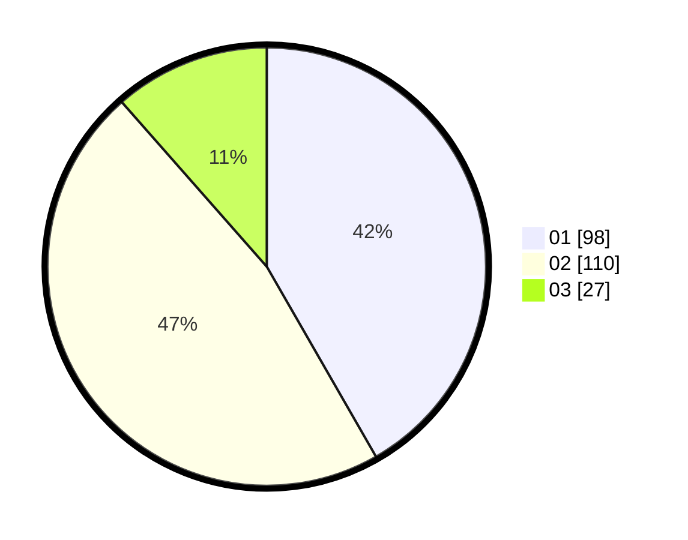

# Hasil

Hasil perolehan suara paslon dapat dilihat pada file paslon-01.txt, paslon-02.txt, dan paslon-03.txt.

Jika tidak ada, artinya data tersebut belum ada pada SIREKAP.

## Perolehan Suara

 * Paslon 01: **98**.
 * Paslon 02: **110**.
 * Paslon 03: **27**.

## Foto C Plano

https://sirekap-obj-formc.kpu.go.id/7269/pemilu/ppwp/31/73/01/10/02/3173011002068-20240214-232503--164bb96c-c583-4524-bafa-be3f50a26c99.jpg

https://sirekap-obj-formc.kpu.go.id/7269/pemilu/ppwp/31/73/01/10/02/3173011002068-20240214-202635--cb3e12ec-3778-4337-ab0e-e9c531cd757b.jpg

https://sirekap-obj-formc.kpu.go.id/7269/pemilu/ppwp/31/73/01/10/02/3173011002068-20240214-202717--bf9c2553-1517-479e-a7c0-e5791162e5b4.jpg
