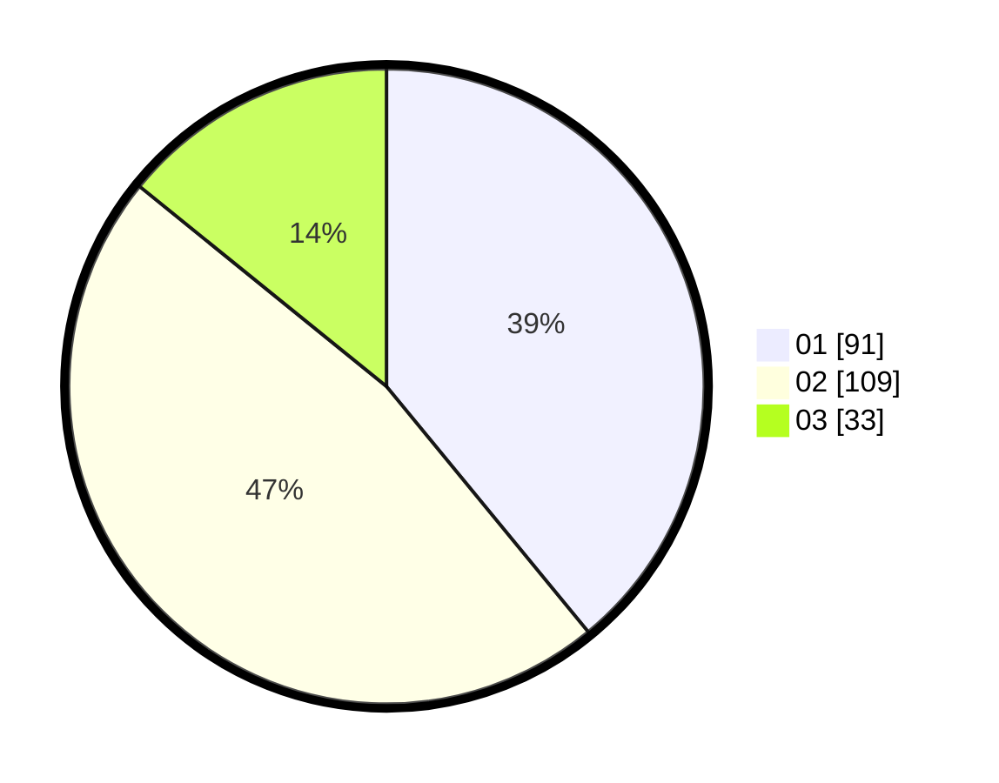

# Hasil

Hasil perolehan suara paslon dapat dilihat pada file paslon-01.txt, paslon-02.txt, dan paslon-03.txt.

Jika tidak ada, artinya data tersebut belum ada pada SIREKAP.

## Perolehan Suara

 * Paslon 01: **91**.
 * Paslon 02: **109**.
 * Paslon 03: **33**.

## Foto C Plano

https://sirekap-obj-formc.kpu.go.id/6000/pemilu/ppwp/31/73/01/10/02/3173011002069-20240214-204103--1163af11-ff8e-4245-9728-ee2d81f99a91.jpg

https://sirekap-obj-formc.kpu.go.id/6000/pemilu/ppwp/31/73/01/10/02/3173011002069-20240214-204148--2aa20818-92d2-4ea3-876c-4161a6dd3a71.jpg

https://sirekap-obj-formc.kpu.go.id/6000/pemilu/ppwp/31/73/01/10/02/3173011002069-20240214-204221--c463cb89-ae60-4d23-82d2-6d5953ff01f8.jpg
