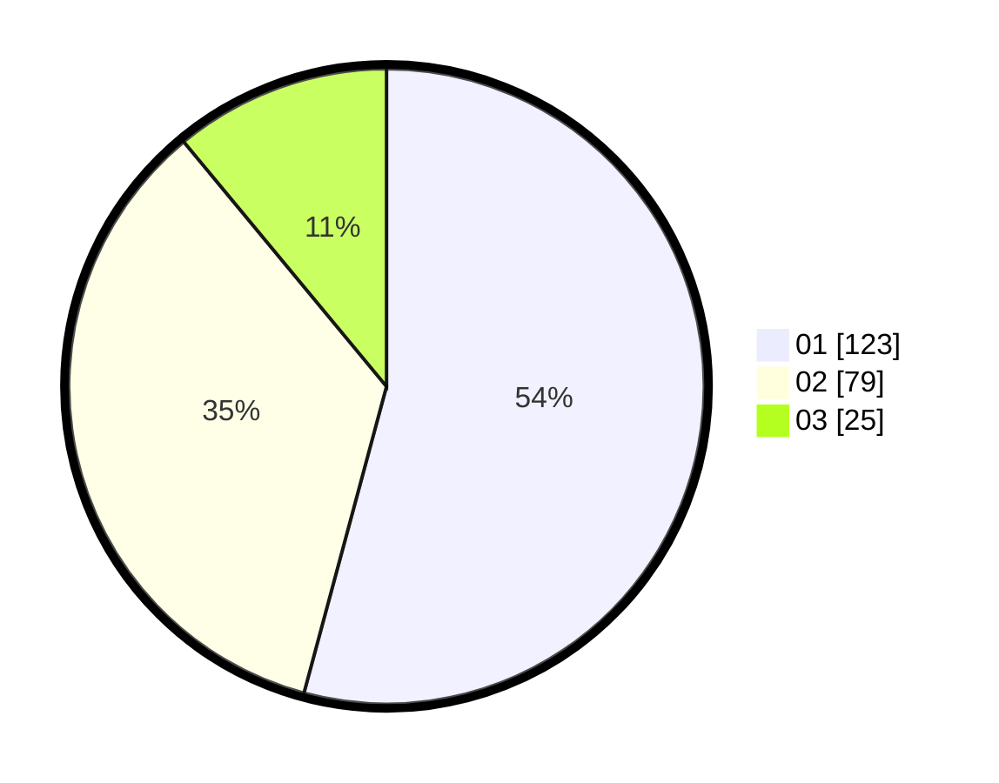

# Hasil

Hasil perolehan suara paslon dapat dilihat pada file paslon-01.txt, paslon-02.txt, dan paslon-03.txt.

Jika tidak ada, artinya data tersebut belum ada pada SIREKAP.

## Perolehan Suara

 * Paslon 01: **123**.
 * Paslon 02: **79**.
 * Paslon 03: **25**.

## Foto C Plano

https://sirekap-obj-formc.kpu.go.id/9a61/pemilu/ppwp/31/73/01/10/02/3173011002070-20240214-221916--858c2a57-946f-4b08-80c2-32f6cc649c14.jpg

https://sirekap-obj-formc.kpu.go.id/9a61/pemilu/ppwp/31/73/01/10/02/3173011002070-20240214-222300--f65494b3-9900-4c5c-9bed-cca36096f193.jpg

https://sirekap-obj-formc.kpu.go.id/9a61/pemilu/ppwp/31/73/01/10/02/3173011002070-20240214-222519--ccd96d3b-b801-4cc9-9d8e-f8853b9d275b.jpg

## DATA PEMILIH TETAP

Jumlah pemilih dalam DPT: **273**.
 * L: **131**.
 * P: **142**.

## DATA PENGGUNA HAK PILIH

Jumlah pengguna hak pilih dalam DPT: **232**.
 * L: **109**.
 * P: **123**.

Jumlah pengguna hak pilih dalam DPTb: **1**.
 * L: **1**.
 * P: **0**.

Jumlah pengguna hak pilih dalam DPK: **0**.
 * L: **0**.
 * P: **0**.

Jumlah pengguna hak pilih: **233**.
 * L: **110**.
 * P: **123**.

## JUMLAH SUARA SAH DAN TIDAK SAH

JUMLAH SELURUH SUARA SAH: **227**.

JUMLAH SUARA TIDAK SAH: **6**.

JUMLAH SELURUH SUARA SAH DAN SUARA TIDAK SAH: **233**.
