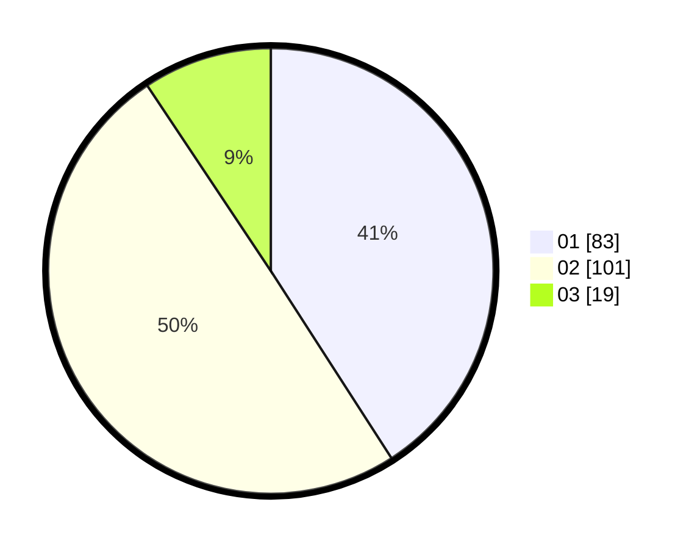

# Hasil

Hasil perolehan suara paslon dapat dilihat pada file paslon-01.txt, paslon-02.txt, dan paslon-03.txt.

Jika tidak ada, artinya data tersebut belum ada pada SIREKAP.

## Perolehan Suara

 * Paslon 01: **83**.
 * Paslon 02: **101**.
 * Paslon 03: **19**.

## Foto C Plano

https://sirekap-obj-formc.kpu.go.id/9914/pemilu/ppwp/31/73/01/10/02/3173011002071-20240214-214949--529eeec9-7ae3-4df7-81f8-edbadfc984c3.jpg

https://sirekap-obj-formc.kpu.go.id/9914/pemilu/ppwp/31/73/01/10/02/3173011002071-20240214-215016--b9582a59-c434-424a-a619-0cbbbdbb8b3b.jpg

https://sirekap-obj-formc.kpu.go.id/9914/pemilu/ppwp/31/73/01/10/02/3173011002071-20240214-215037--5ceba6d9-f17f-46ee-b0ae-585b31af8c77.jpg
