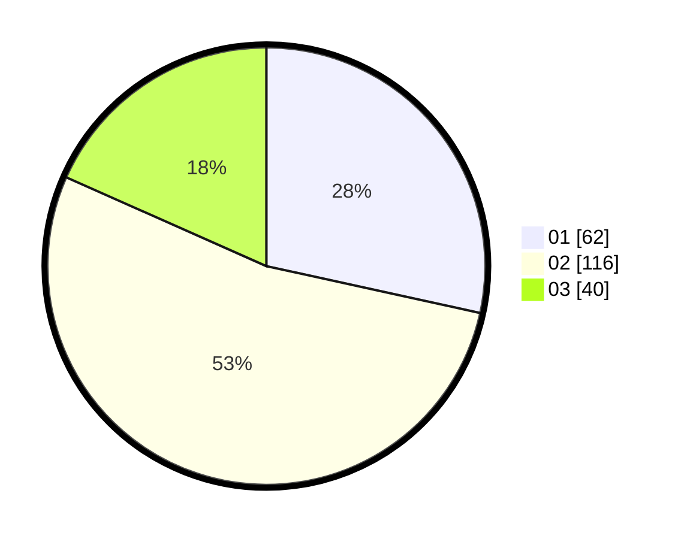

# Hasil

Hasil perolehan suara paslon dapat dilihat pada file paslon-01.txt, paslon-02.txt, dan paslon-03.txt.

Jika tidak ada, artinya data tersebut belum ada pada SIREKAP.

## Perolehan Suara

 * Paslon 01: **62**.
 * Paslon 02: **116**.
 * Paslon 03: **40**.

## Foto C Plano

https://sirekap-obj-formc.kpu.go.id/e0d2/pemilu/ppwp/31/73/01/10/02/3173011002072-20240215-002534--c79752d4-7918-490e-a549-1d9462872a38.jpg

https://sirekap-obj-formc.kpu.go.id/e0d2/pemilu/ppwp/31/73/01/10/02/3173011002072-20240216-141606--b3520d39-186e-4356-898e-3f5c259a261b.jpg

https://sirekap-obj-formc.kpu.go.id/e0d2/pemilu/ppwp/31/73/01/10/02/3173011002072-20240216-141606--14df7d7f-1a61-4b1c-9670-d4a807583390.jpg

## DATA PEMILIH TETAP

Jumlah pemilih dalam DPT: **277**.
 * L: **138**.
 * P: **139**.

## DATA PENGGUNA HAK PILIH

Jumlah pengguna hak pilih dalam DPT: **211**.
 * L: **100**.
 * P: **111**.

Jumlah pengguna hak pilih dalam DPTb: **2**.
 * L: **0**.
 * P: **2**.

Jumlah pengguna hak pilih dalam DPK: **6**.
 * L: **3**.
 * P: **3**.

Jumlah pengguna hak pilih: **219**.
 * L: **103**.
 * P: **116**.

## JUMLAH SUARA SAH DAN TIDAK SAH

JUMLAH SELURUH SUARA SAH: **218**.

JUMLAH SUARA TIDAK SAH: **1**.

JUMLAH SELURUH SUARA SAH DAN SUARA TIDAK SAH: **219**.
