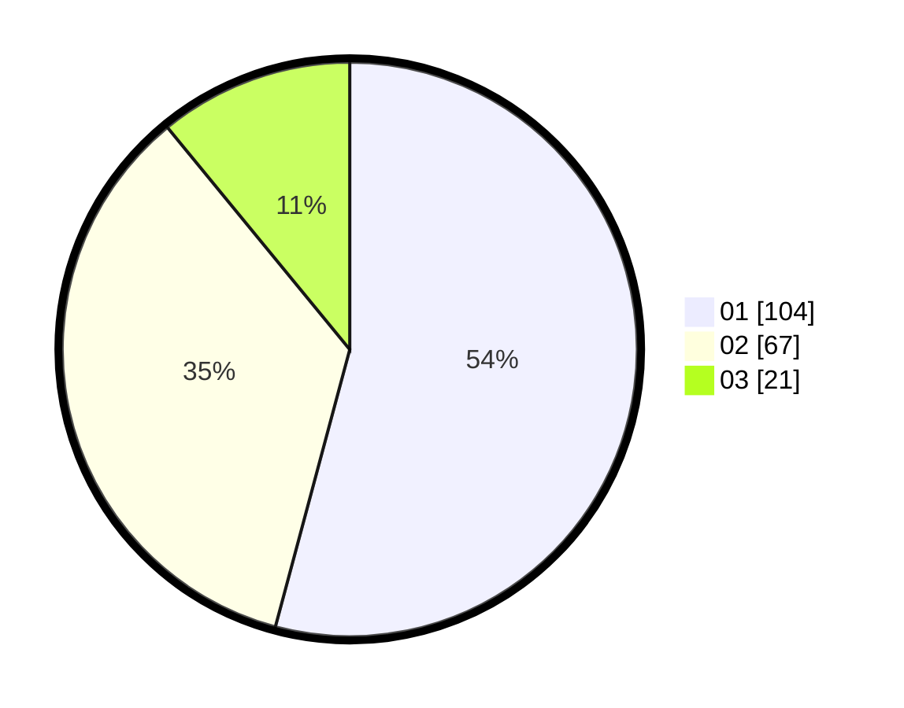

# Hasil

Hasil perolehan suara paslon dapat dilihat pada file paslon-01.txt, paslon-02.txt, dan paslon-03.txt.

Jika tidak ada, artinya data tersebut belum ada pada SIREKAP.

## Perolehan Suara

 * Paslon 01: **104**.
 * Paslon 02: **67**.
 * Paslon 03: **21**.

## Foto C Plano

https://sirekap-obj-formc.kpu.go.id/2912/pemilu/ppwp/31/73/01/10/02/3173011002074-20240214-233545--118f588d-9fe0-4c96-aa50-fbcfe0aabab7.jpg

https://sirekap-obj-formc.kpu.go.id/2912/pemilu/ppwp/31/73/01/10/02/3173011002074-20240214-194810--ca90a0a6-c7c1-4865-9e6a-4c8455da31cb.jpg

https://sirekap-obj-formc.kpu.go.id/2912/pemilu/ppwp/31/73/01/10/02/3173011002074-20240214-193559--0151e997-ac57-4984-8ef5-b48589da93d9.jpg
