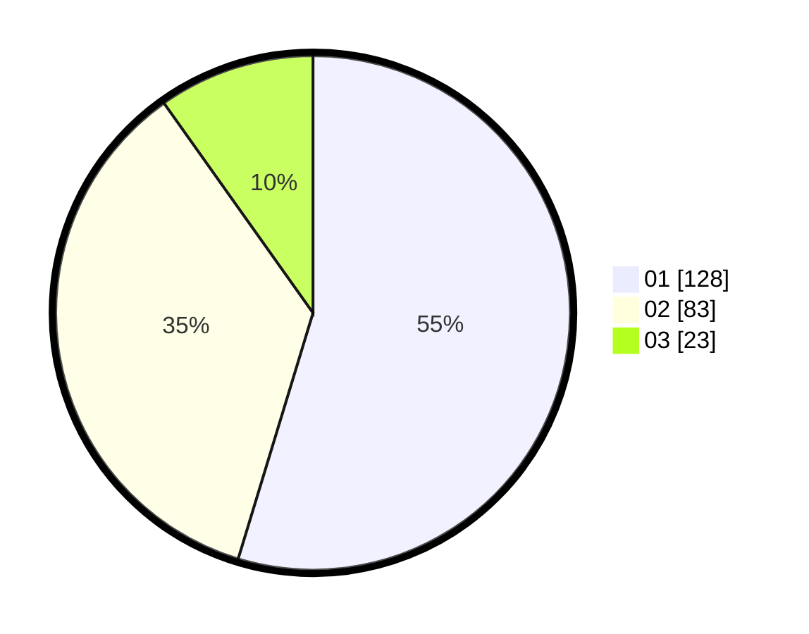

# Hasil

Hasil perolehan suara paslon dapat dilihat pada file paslon-01.txt, paslon-02.txt, dan paslon-03.txt.

Jika tidak ada, artinya data tersebut belum ada pada SIREKAP.

## Perolehan Suara

 * Paslon 01: **128**.
 * Paslon 02: **83**.
 * Paslon 03: **23**.

## Foto C Plano

https://sirekap-obj-formc.kpu.go.id/3360/pemilu/ppwp/31/73/01/10/02/3173011002077-20240216-144619--13b049c9-879d-42b0-96ad-0935401ba7c0.jpg

https://sirekap-obj-formc.kpu.go.id/3360/pemilu/ppwp/31/73/01/10/02/3173011002077-20240216-144620--902e9935-df74-4798-a6d9-923ef16c1590.jpg

https://sirekap-obj-formc.kpu.go.id/3360/pemilu/ppwp/31/73/01/10/02/3173011002077-20240215-152239--583f53da-5454-4b4f-bf70-90c1916398ee.jpg

## DATA PEMILIH TETAP

Jumlah pemilih dalam DPT: **271**.
 * L: **133**.
 * P: **138**.

## DATA PENGGUNA HAK PILIH

Jumlah pengguna hak pilih dalam DPT: **231**.
 * L: **113**.
 * P: **118**.

Jumlah pengguna hak pilih dalam DPTb: **3**.
 * L: **2**.
 * P: **1**.

Jumlah pengguna hak pilih dalam DPK: **0**.
 * L: **0**.
 * P: **0**.

Jumlah pengguna hak pilih: **234**.
 * L: **115**.
 * P: **119**.

## JUMLAH SUARA SAH DAN TIDAK SAH

JUMLAH SELURUH SUARA SAH: **234**.

JUMLAH SUARA TIDAK SAH: **0**.

JUMLAH SELURUH SUARA SAH DAN SUARA TIDAK SAH: **234**.
