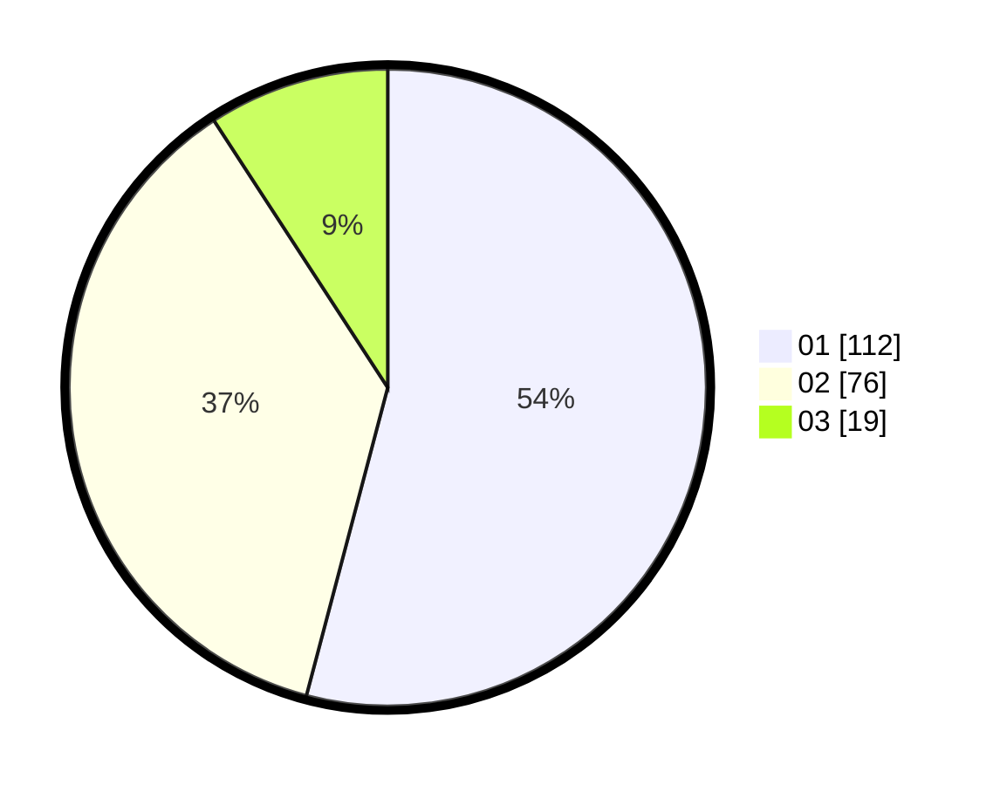

# Hasil

Hasil perolehan suara paslon dapat dilihat pada file paslon-01.txt, paslon-02.txt, dan paslon-03.txt.

Jika tidak ada, artinya data tersebut belum ada pada SIREKAP.

## Perolehan Suara

 * Paslon 01: **112**.
 * Paslon 02: **76**.
 * Paslon 03: **19**.

## Foto C Plano

https://sirekap-obj-formc.kpu.go.id/3845/pemilu/ppwp/31/73/01/10/02/3173011002083-20240216-073818--26f2aeee-f2b5-4f41-9c39-f819aecf1ece.jpg

https://sirekap-obj-formc.kpu.go.id/3845/pemilu/ppwp/31/73/01/10/02/3173011002083-20240216-073825--1e1c1607-ba75-4d91-986a-f0590699bcd4.jpg

https://sirekap-obj-formc.kpu.go.id/3845/pemilu/ppwp/31/73/01/10/02/3173011002083-20240216-073823--0b062765-d612-42ea-bf55-352198b126ec.jpg

## DATA PEMILIH TETAP

Jumlah pemilih dalam DPT: **270**.
 * L: **137**.
 * P: **133**.

## DATA PENGGUNA HAK PILIH

Jumlah pengguna hak pilih dalam DPT: **200**.
 * L: **98**.
 * P: **102**.

Jumlah pengguna hak pilih dalam DPTb: **4**.
 * L: **2**.
 * P: **2**.

Jumlah pengguna hak pilih dalam DPK: **7**.
 * L: **4**.
 * P: **3**.

Jumlah pengguna hak pilih: **211**.
 * L: **104**.
 * P: **107**.

## JUMLAH SUARA SAH DAN TIDAK SAH

JUMLAH SELURUH SUARA SAH: **207**.

JUMLAH SUARA TIDAK SAH: **4**.

JUMLAH SELURUH SUARA SAH DAN SUARA TIDAK SAH: **211**.
