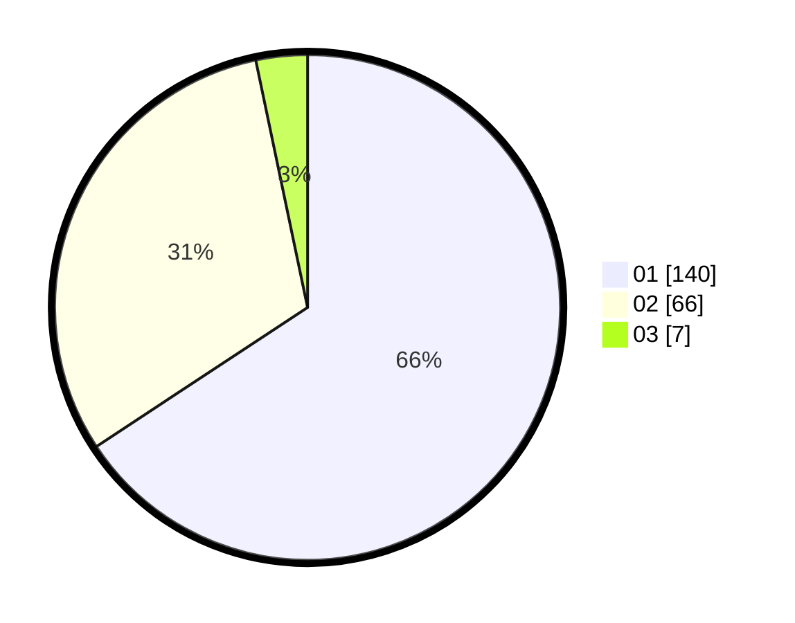

# Hasil

Hasil perolehan suara paslon dapat dilihat pada file paslon-01.txt, paslon-02.txt, dan paslon-03.txt.

Jika tidak ada, artinya data tersebut belum ada pada SIREKAP.

## Perolehan Suara

 * Paslon 01: **140**.
 * Paslon 02: **66**.
 * Paslon 03: **7**.

## Foto C Plano

https://sirekap-obj-formc.kpu.go.id/1a56/pemilu/ppwp/31/73/01/10/02/3173011002086-20240216-003247--6c3f4a74-f190-4443-95d1-e899e53a86dc.jpg

https://sirekap-obj-formc.kpu.go.id/1a56/pemilu/ppwp/31/73/01/10/02/3173011002086-20240216-003252--64724a93-5617-432e-93b0-30015ae40c16.jpg

https://sirekap-obj-formc.kpu.go.id/1a56/pemilu/ppwp/31/73/01/10/02/3173011002086-20240216-003250--8d0cd879-8cf5-4456-84de-4287d240399a.jpg

## DATA PEMILIH TETAP

Jumlah pemilih dalam DPT: **273**.
 * L: **130**.
 * P: **143**.

## DATA PENGGUNA HAK PILIH

Jumlah pengguna hak pilih dalam DPT: **205**.
 * L: **96**.
 * P: **109**.

Jumlah pengguna hak pilih dalam DPTb: **5**.
 * L: **2**.
 * P: **3**.

Jumlah pengguna hak pilih dalam DPK: **4**.
 * L: **2**.
 * P: **2**.

Jumlah pengguna hak pilih: **214**.
 * L: **100**.
 * P: **114**.

## JUMLAH SUARA SAH DAN TIDAK SAH

JUMLAH SELURUH SUARA SAH: **213**.

JUMLAH SUARA TIDAK SAH: **1**.

JUMLAH SELURUH SUARA SAH DAN SUARA TIDAK SAH: **214**.
