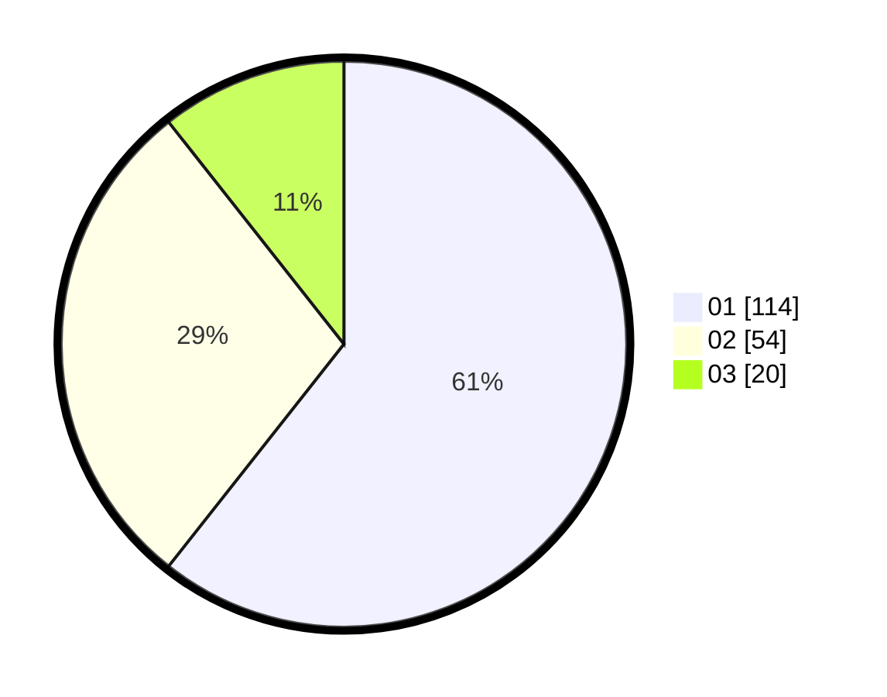

# Hasil

Hasil perolehan suara paslon dapat dilihat pada file paslon-01.txt, paslon-02.txt, dan paslon-03.txt.

Jika tidak ada, artinya data tersebut belum ada pada SIREKAP.

## Perolehan Suara

 * Paslon 01: **114**.
 * Paslon 02: **54**.
 * Paslon 03: **20**.

## Foto C Plano

https://sirekap-obj-formc.kpu.go.id/23f2/pemilu/ppwp/31/73/01/10/02/3173011002088-20240214-191231--54c7201a-c448-495c-9411-85fa39d95fb1.jpg

https://sirekap-obj-formc.kpu.go.id/23f2/pemilu/ppwp/31/73/01/10/02/3173011002088-20240214-185218--78f44813-350c-4502-9ce0-caf9887f80d8.jpg

https://sirekap-obj-formc.kpu.go.id/23f2/pemilu/ppwp/31/73/01/10/02/3173011002088-20240214-185716--aebb079e-09be-4b3e-8256-3d6e2a899e22.jpg

## DATA PEMILIH TETAP

Jumlah pemilih dalam DPT: **240**.
 * L: **111**.
 * P: **129**.

## DATA PENGGUNA HAK PILIH

Jumlah pengguna hak pilih dalam DPT: **189**.
 * L: **87**.
 * P: **102**.

Jumlah pengguna hak pilih dalam DPTb: **0**.
 * L: **0**.
 * P: **0**.

Jumlah pengguna hak pilih dalam DPK: **0**.
 * L: **0**.
 * P: **0**.

Jumlah pengguna hak pilih: **189**.
 * L: **87**.
 * P: **102**.

## JUMLAH SUARA SAH DAN TIDAK SAH

JUMLAH SELURUH SUARA SAH: **188**.

JUMLAH SUARA TIDAK SAH: **1**.

JUMLAH SELURUH SUARA SAH DAN SUARA TIDAK SAH: **189**.
