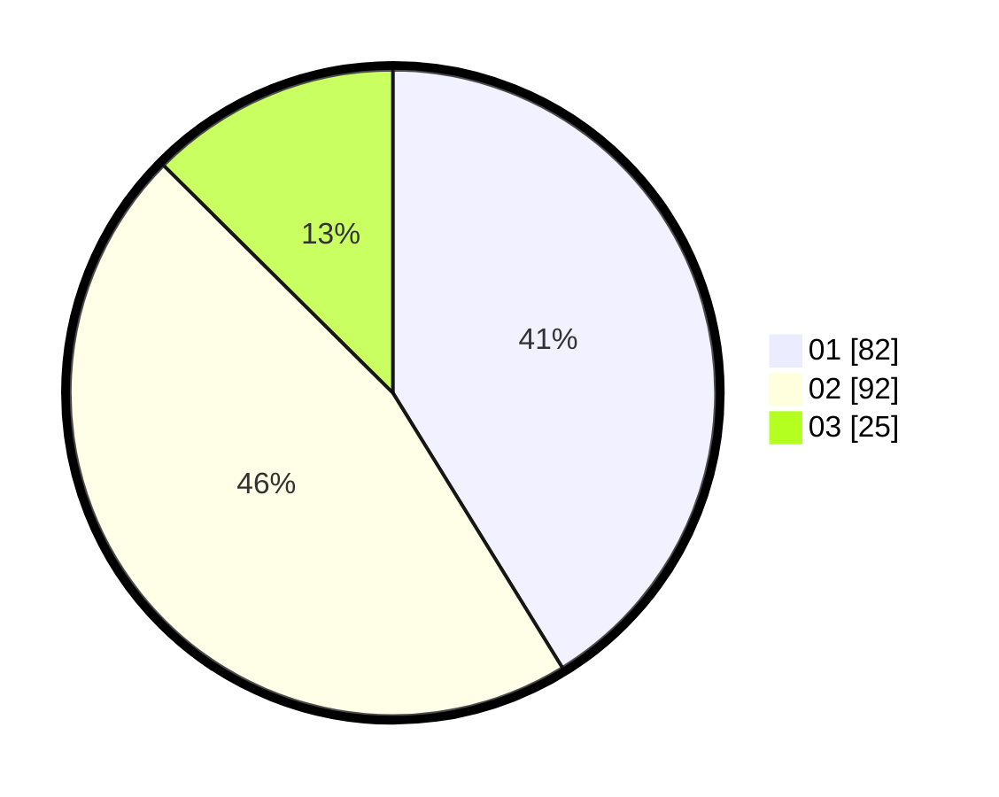

# Hasil

Hasil perolehan suara paslon dapat dilihat pada file paslon-01.txt, paslon-02.txt, dan paslon-03.txt.

Jika tidak ada, artinya data tersebut belum ada pada SIREKAP.

## Perolehan Suara

 * Paslon 01: **82**.
 * Paslon 02: **92**.
 * Paslon 03: **25**.

## Foto C Plano

https://sirekap-obj-formc.kpu.go.id/d622/pemilu/ppwp/31/73/01/10/02/3173011002094-20240216-132640--b8df06cf-87ee-4f07-8af3-8e52b60931b7.jpg

https://sirekap-obj-formc.kpu.go.id/d622/pemilu/ppwp/31/73/01/10/02/3173011002094-20240216-132642--6a21aace-22a4-4904-a886-0a1bd376b1d6.jpg

https://sirekap-obj-formc.kpu.go.id/d622/pemilu/ppwp/31/73/01/10/02/3173011002094-20240216-132641--a75343f3-8241-4074-a684-1e8a94ff25fc.jpg

## DATA PEMILIH TETAP

Jumlah pemilih dalam DPT: **280**.
 * L: **134**.
 * P: **146**.

## DATA PENGGUNA HAK PILIH

Jumlah pengguna hak pilih dalam DPT: **207**.
 * L: **98**.
 * P: **109**.

Jumlah pengguna hak pilih dalam DPTb: **1**.
 * L: **0**.
 * P: **1**.

Jumlah pengguna hak pilih dalam DPK: **0**.
 * L: **0**.
 * P: **0**.

Jumlah pengguna hak pilih: **208**.
 * L: **98**.
 * P: **110**.

## JUMLAH SUARA SAH DAN TIDAK SAH

JUMLAH SELURUH SUARA SAH: **203**.

JUMLAH SUARA TIDAK SAH: **5**.

JUMLAH SELURUH SUARA SAH DAN SUARA TIDAK SAH: **208**.
