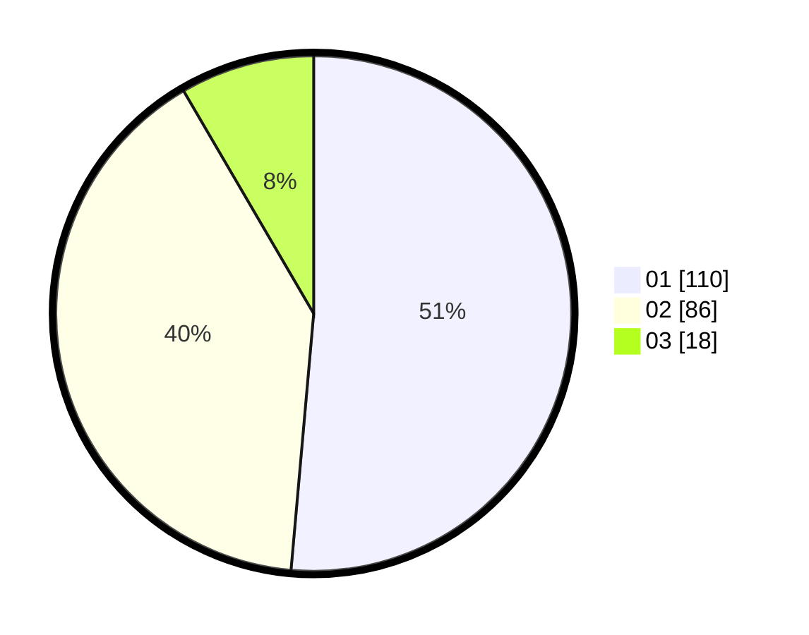

# Hasil

Hasil perolehan suara paslon dapat dilihat pada file paslon-01.txt, paslon-02.txt, dan paslon-03.txt.

Jika tidak ada, artinya data tersebut belum ada pada SIREKAP.

## Perolehan Suara

 * Paslon 01: **110**.
 * Paslon 02: **86**.
 * Paslon 03: **18**.

## Foto C Plano

https://sirekap-obj-formc.kpu.go.id/0009/pemilu/ppwp/31/73/01/10/02/3173011002095-20240214-231920--2991ee3f-c843-43fa-823c-b9974001b682.jpg

https://sirekap-obj-formc.kpu.go.id/0009/pemilu/ppwp/31/73/01/10/02/3173011002095-20240214-231828--c87a42cd-f92a-431c-b9e0-cb47b9110434.jpg

https://sirekap-obj-formc.kpu.go.id/0009/pemilu/ppwp/31/73/01/10/02/3173011002095-20240214-232003--ff6a61e3-89bf-45c3-ae32-205f45bf6894.jpg

## DATA PEMILIH TETAP

Jumlah pemilih dalam DPT: **280**.
 * L: **143**.
 * P: **137**.

## DATA PENGGUNA HAK PILIH

Jumlah pengguna hak pilih dalam DPT: **212**.
 * L: **100**.
 * P: **112**.

Jumlah pengguna hak pilih dalam DPTb: **0**.
 * L: **0**.
 * P: **0**.

Jumlah pengguna hak pilih dalam DPK: **6**.
 * L: **4**.
 * P: **2**.

Jumlah pengguna hak pilih: **218**.
 * L: **104**.
 * P: **114**.

## JUMLAH SUARA SAH DAN TIDAK SAH

JUMLAH SELURUH SUARA SAH: **214**.

JUMLAH SUARA TIDAK SAH: **4**.

JUMLAH SELURUH SUARA SAH DAN SUARA TIDAK SAH: **218**.
